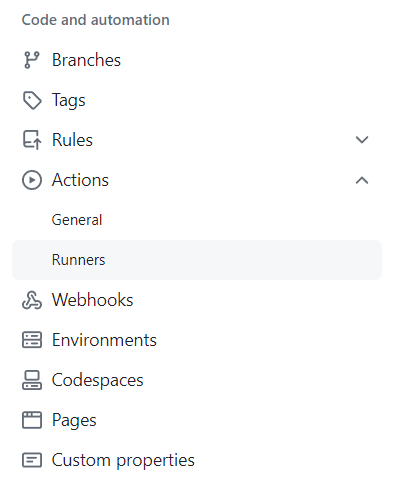
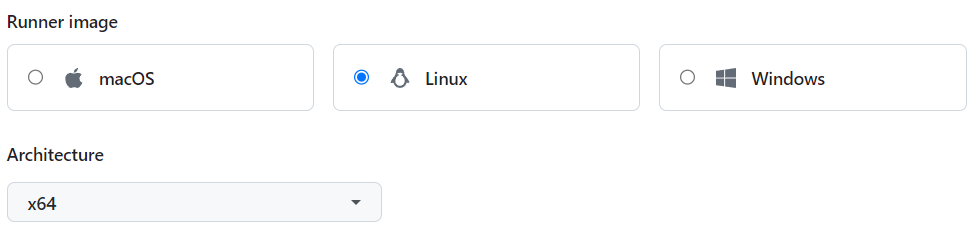
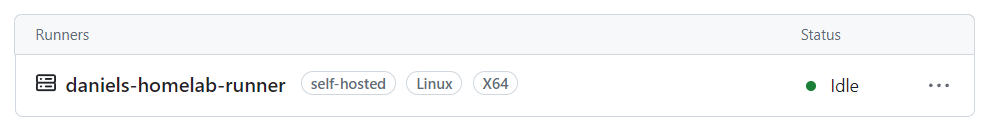

## Table of Contents

- [Introduction](#introduction)
- [Setting up a Self Hosted Runner](#setting-up-a-self-hosted-runner)
- [Structure of a GitHub Action](#structure-of-a-github-action)
  - [A (simple) GitHub action has 4 main parts:](#a-simple-github-action-has-4-main-parts-)
- [GitHub Action to build Docker Images](#github-action-to-build-docker-images)
  - [Process overview & requirements](#process-overview-requirements)
  - [1. Environment variables and secrets](#1-environment-variables-and-secrets)
  - [2. Triggers](#2-triggers)
  - [4. Job Setup](#4-job-setup)
- [Full GitHub Actions template to release a docker image](#full-github-actions-template-to-release-a-docker-image)
- [Conclusion](#conclusion)


## Introduction

When I released a new version of a web app, this was the process I followed, which might sound familiar to you:

1. I merged everything into the master branch
2. SSH into the deployment server
3. git fetch
4. git checkout
5. git pull
6. Build docker images (this took loooong and once the web app was big enough, it would fail)
7. Then I would have to build the image in my computer or another specific server to avoid the production server crashing
8. Push that to a registry
9. Go back to the server and pull from the registry
10. Realize you did not update an environment variable
11. **AGHHHJJJ!!!**
12. 

**Here's how I do it now:**

1. Push a new semantic versioning ([semver](https://semver.org/)) release tag. i.e. `1.0.1` from any branch I like
2. That's it!

> This works perfectly with [the perfect Git strategy](https://daniel.es/blog/the-perfect-git-strategy/)


---

## Setting up a Self Hosted Runner

> If you already know everything about GitHub actions and just want to know how the structure to build docker images, proceed to [GitHub Action to build Docker Images](#github-action-to-build-docker-images)

**Definition**: A runner is an instance that _runs_ whatever you want in your GitHub action. From making it print `Hello World` to building and deploying apps, to making you coffee (seriously). Think of it as a user that runs whatever you tell it to in a remote server (linux, windows...).

GitHub gives you 2 options:

- Use one of their runners for free up to X minutes every month and then pay for it
- Spin up a self hosted runner and use that for free

If you go with the first option skip this, otherwise continue reading.

Since I already have a home lab and setting up a runner is quite easy, self hosted was the way to save a few bucks. You can also do this with an old computer or even a raspberry pi you have laying around.

> If you want to learn more about self hosted runners look into [GitHub's documentation](https://docs.github.com/en/actions/hosting-your-own-runners/managing-self-hosted-runners/about-self-hosted-runners).

**This is what you need to set up a self hosted runner:**

1. Select the OS you want your runner to be. I'm a fan of Ubuntu and I can pretty much do everything I need with it, so I went with a Linux runner.
2. Make sure you have any necessary packages installed in the runner. For my use case I would need to install Docker first.
3. Go to your GitHub repo, then Settings
   
4. In the left panel hit **Actions** and then **Runners**
   
5. Select **New self-hosted Runner**
   
6. Select the OS you want to use and architecture
   
7. Follow the terminal commands displayed below your selection to finish setting up your runner. I do not want to post the commands here since GitHub updates them every once in a while, so just follow their instructions over there.
8. Once you finish setting the runner up in your Linux machine you should see it in the Runners page from before and you're ready to use it!
   

---

## Structure of a GitHub Action

GitHub actions are defined in `.yml` files. They are basically a set of instructions telling the runner what to do.

They live under `.github/workflows/` in your repository and **will be live and working once you push them to your main branch**.

You can either write them directly with GitHub's web interface or with your favorite code editor and push them to your main branch.

> If you use VSCode they have a GitHub Actions extension that comes in really handy to edit the workflows and see what's running

### A (simple) GitHub action has 4 main parts:

#### 1. `name`

Easy, this is just the name you want to give the action to track it later on.

```yml
name: My GitHub action name
```

#### 2. `on`

This is what you want to trigger the action on. The most common case is to tricker an action on a push to a specific branch or when opening a pull request. But there are many triggers.

You can see documentation on all the triggers here:

https://docs.github.com/en/actions/using-workflows/events-that-trigger-workflows

Here's an example code to:

- Be able to trigger the GitHub action manually. For more information on how to trigger this from the GitHub web interface, see "[Manually running a workflow](https://docs.github.com/en/actions/managing-workflow-runs/manually-running-a-workflow)."
- Trigger the action when there's a push to the `my-branch-name` and `my-other-branch-name` branches.

```yml
on:
  # Trigger the action manually from the UI
  workflow_dispatch:
  # Trigger the action when pushing to certain branches
  push:
    branches:
      - 'my-branch-name'
      - 'my-other-branch-name'
```

#### 3. `env`

Here you can set environment variables and secrets for a specific Action. This can be used together with the repository Variables and Secrets in the GitHub website.

If there's something you use in multiple steps or jobs it is useful to set it up here so that you only need to change one line.

```yml
env:
  DOCKER_IMAGE_NAME: my-image
```

#### 4. `jobs`

These are the individual series of steps you want to execute. Each job has a series of sequential steps and every job can be run asynchronously. You can also create a dependency so a job doesn't run until a previous job has finished.

> **Differences between Jobs and Steps**
>
> - **Jobs** are individual, asynchronous tasks. This means that if you have several tasks that can happen asynchronously (at the same time) (i.e.: deploying an app and uploading new documentation) you can put them in separate jobs. If you have several runners you can execute several jobs at the same time.
> - **Steps** are actions that happen synchronously. If you have tasks that need to run one after the other (i.e.: Building a docker image and then pushing it to a Docker registry) set them up in steps instead of jobs.

Sample code:

```yml
jobs:
  build_docker_images:
    # Job name that shows in the GitHub UI
    name: Build Docker Images
    # Runner to use
    runs-on: self-hosted

    steps:
    - name: Checkout
      uses: actions/checkout@v3

   ...
```

You can set up as many jobs and steps as you like in a single action file.

---

## GitHub Action to build Docker Images

In this section I will show you how to build a docker image from a `Dockerfile` and push it to Dockerhub or your private Docker Registry. All by just creating a version tag.

### Process overview & requirements

First, if you're using a self-hosted runner, check that it's running and available in the repository you want to have this on. And that you understand [the structure of a GitHub action](#structure-of-a-github-action).

**Here are the requirements:**

When I push a version tag, I want to get the version name (i.e.: `1.0.1`), then build the Docker image and tag it with that version number as well as the `latest` tag (i.e.: `my-image:1.0.1` and `my-image:latest`).

After this, I want to push the image to a private Docker Registry I self-host and remove all data from the runner. But you can also do this to push the docker image to DockerHub.

I also want to store the build cache so that future images build faster.

**Here's the process overview:**

1. Trigger the action manually or by pushing a version tag
2. Git checkout the code from that specific tag
3. Get the version number from the tag
4. Build the Docker image
5. Once the image is built, tag it with the version number and the docker registry of my choosing
6. Push the image to the registry

### 1. Environment variables and secrets

**Environment variables**

In case I ever need to change the registry URL or image name I set the following environment variables to be able to do so easily:

```yml
# Workflow environment variables
env:
  DOCKER_IMAGE_NAME: my-image
  DOCKER_REGISTRY_URL: myregistry.domain.com
```

**Secrets**

I also want to create these github action secrets in my reo to be able to access the docker registry. I like to create a comment in my workflow file so I don't forget if I move the repository or something.

Please, for the love of God, DO NOT PUT THESE IN YOUR WORKFLOW FILE.

```yml
# Required actions secrets:
# - DOCKER_USERNAME: Username for docker registry login
# - DOCKER_PASSWORD: Password for docker registry login
```

### 2. Triggers

I want not only for the action to be triggered when I push a version tag, but also manually.

```yml
name: Build release Docker image

on:
  # Trigger the action manually from the UI
  workflow_dispatch:
  # Trigger the action when a version tag is pushed
  push:
    tags:
      - '[0-9]+.[0-9]+.[0-9]+' # Push events to matching numeric semver tags, i.e., 1.0.0, 20.15.10
```

### 4. Job Setup

I will only require a single job since all my steps need to be sequential.

```yml
jobs:
  build_docker_images:
    # Job name that shows in the GitHub Website:
    name: Build Docker Images
    # Runner to use:
    runs-on: self-hosted

    # Begin the steps
    steps:
      - step1
      - step2
      - ...
```

#### 4.1 Get the code from GitHub

GitHub, and many other services like Docker, provide ready-to-use steps. In this case we're going to use the `actions/checkout@v3` step from GitHub, which just fetches the code from the repository.

```yml
# Checkout the code
- name: Checkout code
  uses: actions/checkout@v4
  with:
    fetch-depth: 0 # Do not get extra git branches to save time
```

#### 4.2 Set up docker builder

Like GitHub, Docker provides their own set of ready-to-use steps, in this case there is a builder setup action

```yml
- name: Set up Docker Buildx
  uses: docker/setup-buildx-action@v3
```

#### 4.3 Login into the Docker Registry

```yml
- name: Login to Docker Registry
  uses: docker/login-action@v3
  with:
    registry: ${{ env.DOCKER_REGISTRY }}
    username: ${{ secrets.DOCKER_USERNAME }}
    password: ${{ secrets.DOCKER_PASSWORD }}
```

#### 4.4 Get the version number

Here I just get the tag name (`X.Y.Z`). Since we constrained the triggers to only trigger on numeric semver tags, we confidently know that the tag will be in the right format: `X.Y.Z`.

```yml
- name: Get the tag name
  id: get_version
  run: echo "VERSION=${GITHUB_REF#refs/tags/}" >> $GITHUB_OUTPUT
```

#### 4.5 Build and push the docker images

Docker provides a super convenient ready-to-use action for this step.

```yml
- name: Build and Push the Docker Image
  uses: docker/build-push-action@v6
  with:
    context: .
    file: ./Dockerfile
    push: true
    tags: |
      ${{ env.DOCKER_REGISTRY }}/${{ env.DOCKER_IMAGE_NAME }}:${{ steps.get_version.outputs.VERSION }}
      ${{ env.DOCKER_REGISTRY }}/${{ env.DOCKER_IMAGE_NAME }}:latest
    cache-from: type=registry,ref=${{ env.DOCKER_REGISTRY }}/${{ env.DOCKER_IMAGE_NAME }}:buildcache
    cache-to: type=registry,ref=${{ env.DOCKER_REGISTRY }}/${{ env.DOCKER_IMAGE_NAME }}:buildcache,mode=max
```

Since this step is not as straightforward let me explain:

- `context: .`: We're telling the builder to use the root folder of the repository as the build context. This is useful for instance if you have a monorepo with a backend and a frontend directory. You can create two jobs for each where the context changes.
- `file: ./Dockerfile`: We're telling the builder where the Dockerfile is
- `push: true`: We want to push the images as well
- The tags section indicates that we want to push two tags of this image. This is also useful if we want to push to multiple directories for instance. Here I use the environment variables we defined at the begining of the workflow and I'm pushing the version tag as well as the latest tag.
- `cache-from:`: This means where we're pulling the build cache from, to make consequent builds faster. In this case we get it from the registry.
- `cache-to:`: Similar to `chache-from`, we're indicating where the build cache should be stored, in this case it's the registry.

## Full GitHub Actions template to release a docker image

Here's the full action code. You can copy and paste it into your YML file and modify it as needed:

```yml
# This workflow will build a Docker image
# and push them to a private docker registry when a release tag (i.e.: 1.0.1)
# is pushed to the repository.
#
# It runs on a self hosted runner.
# You can change the runner to 'ubuntu-latest' if you want to use a GitHub hosted runner.
#
# Required actions secrets in the repository:
# - DOCKER_USERNAME: Username for docker registry login
# - DOCKER_PASSWORD: Password for docker registry login

# Script environment variables
env:
  DOCKER_IMAGE_NAME: my-image
  DOCKER_REGISTRY: myregistry.mydomain.com

name: Build and Push Docker Image

# Triggers
on:
  # Trigger the action manually from the UI
  workflow_dispatch:
  # Trigger the action when a version tag is pushed
  push:
    tags:
      - '[0-9]+.[0-9]+.[0-9]+' # Push events to matching numeric semver tags, i.e., 1.0.0, 20.15.10

jobs:
  build-and-push-landing-page:
    name: Build and Push Landing Page Docker Image
    runs-on: self-hosted

    steps:
      - name: Checkout code
        uses: actions/checkout@v4
        with:
          fetch-depth: 0

      - name: Set up Docker Buildx
        uses: docker/setup-buildx-action@v3

      - name: Login to Docker Registry
        uses: docker/login-action@v3
        with:
          registry: ${{ env.DOCKER_REGISTRY }}
          username: ${{ secrets.DOCKER_USERNAME }}
          password: ${{ secrets.DOCKER_PASSWORD }}

      - name: Get the tag name
        id: get_version
        run: echo "VERSION=${GITHUB_REF#refs/tags/}" >> $GITHUB_OUTPUT

      - name: Build and push Landing Page Docker image
        uses: docker/build-push-action@v6
        with:
          context: .
          file: ./Dockerfile
          push: true
          tags: |
            ${{ env.DOCKER_REGISTRY }}/${{ env.DOCKER_IMAGE_NAME }}:${{ steps.get_version.outputs.VERSION }}
            ${{ env.DOCKER_REGISTRY }}/${{ env.DOCKER_IMAGE_NAME }}:latest
          cache-from: type=registry,ref=${{ env.DOCKER_REGISTRY }}/${{ env.DOCKER_IMAGE_NAME }}:buildcache
          cache-to: type=registry,ref=${{ env.DOCKER_REGISTRY }}/${{ env.DOCKER_IMAGE_NAME }}:buildcache,mode=max
```

---

## Conclusion

With this set up you now automatically will have Docker images ready for use in the Registry of your choice.

I will create a future article showing how to automatically deploy a docker image once it's built and pushed to a registry.
