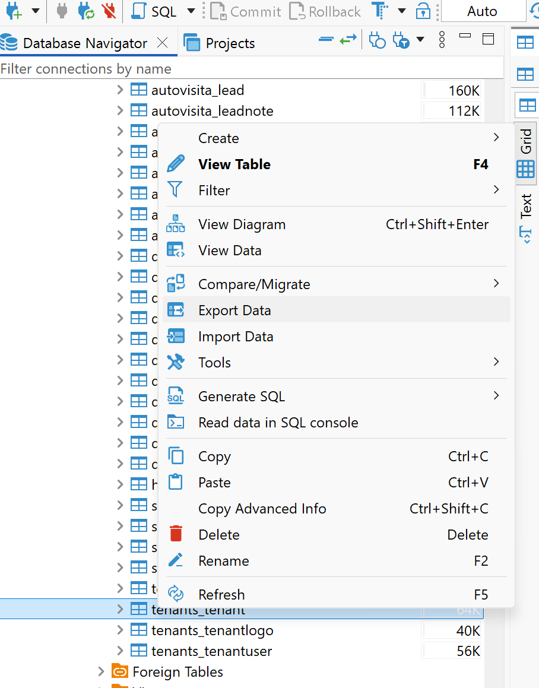

import NewsletterSignup from '../../../components/common/newsletterSignup.tsx';

## Introduction

For one of my projects, I refactored the backend code and started from scratch after noticing there was a much easier way to do it.

Note that you should not really do this if you already have something launched, but in this case, instead of adding a bunch of migrations, I decided to reset all my django migrations and deploy the backend with a new shiny database.

So now I needed to migrate all the data from the old database to the new one.

Note that a database migration can also come from upgrading your postgres database version as well, or even when migrating server vendors. Basically any process that requires you to create a new database instance somewhere else from the one you are using.

<NewsletterSignup client:visible />

## 1. Creating the new database and connect your django app to it

Create a new postgres database wherever you get your databases from. In my case this was a personal project, so I just created a new docker container with postgres and created a new database using psql.

Then deploy your django app, point it to the new database, and execute the migrations:

```bash
python manage.py migrate
```

This will create the tables in the new database.

## 2. Migrating the data from one database to the other

There are several ways you can do this, using python scrips, connecting with psql and running some sql commands, but in my case I love using DBeaver for tasks like this.

I use[DBeaver community](https://dbeaver.io/download/). It's totally free to use and it's UI is quite intuitive.

Although you don't have to do this, I like opening 2 separate DBeaver windows, one for the old database and one for the new one. But you can definitely do everything in the same window.

There are 2 main ways to transfer the data from the old database to the new one:

1. Exporting the data from the old database directly to the new one.
2. Exporting the data from the old database to a csv file and then importing it into the new database.

### Option 1: Exporting the data from the old database directly to the new one

1. Right click on the table you want to migrate and select `Export Data`



2. Select "Database table(s)"


3. Where it says "Target container" select the new database you created. (If you don't see it, you will have to connect to it first in DBeaver)

4. Then in the table below, in the "Target" column, ensure that the table name of the new database is correct and ensure "Mapping" is set to "existing".

5. Click "Next" 2 times and then adjust the options to your liking. If your new database is void of data, the default options should be fine.

6. Click "Proceed" and you should see the data being migrated to the new database.

### Option 2: Exporting the data from the old database to a csv file and then importing it into the new database

I like this option when I need to modify some of the data before importing it into the new database.

1. Follow the previous steps until you get to the "Export Data" window.

2. Select "CSV" as the format.

3. Click "Next" 3 times and then adjust the export settings (like the export path, the delimiter, etc) to your liking.

4. Click "Proceed" and the CSV should download.

5. Now go to the new database and right click on the table you want to migrate and select `Import Data`

6. Select "CSV" as the format.

7. Select the CSV file you downloaded and adjust the options to your liking.

8. Click "Proceed" and you should see the data being imported into the new database.

## 3. Reseting the primary key sequence in the new PostgreSQL database

This is the most important step. If you don't do this, you will get errors when you try to create new objects in the new database.

### Problem description

PostgreSQL keeps track of the last primary key value used in a table and uses it to generate the next value. This is called the sequence.

When create a new database, this sequence is set to 1. But when you migrate the data from the old database to the new one, the primary key sequence is not reset to what it was in the old database, so you will get errors when you try to create new objects in the new database, as django will try to use a primary key that already exists.

### Solution

You need to reset the primary key sequence in the new database.

1. Go to your deployed django app's shell and ensure psql is installed.

   You can install the psql client with:

   ```bash
   sudo apt update && sudo apt install postgresql-client
   ```

2. Run the following django command:

   ```bash
   python manage.py sqlsequencereset <your_app_name> | python manage.py dbshell
   ```

   Change `<your_app_name>` to the name of the app you want to reset the sequences for.

   This command has 2 steps:

   1. It generates the sql commands to reset the sequences.
   2. It executes the sql commands in the new database.

   > If you just want to generate the sql commands to then execute them by yourself using psql or DBeaver, you can run the following command:
   >
   > ```bash
   > python manage.py sqlsequencereset <your_app_name>
   > ```
   >
   > This will generate the sql commands to reset the sequences and print them to the console.

3. You should see the sequences being reset in the new database. (In DBeaver you can go to the "Sequences" directory and see the sequences being reset to the correct values)

4. You can now create new objects in the new database.

## Conclusion

There's not much more to it, it's quite simple but there are some crucial steps that you should not forget to avoid any errors.

Thanks to [this blog post](https://www.calazan.com/how-to-reset-the-primary-key-sequence-in-postgresql-with-django/) for the explanation of the primary key sequence.
