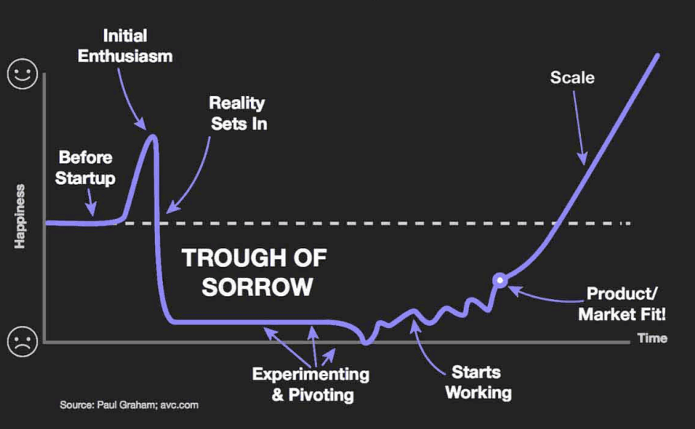

Hey there!

Feelings, huh? Well, they are the reason we do things, so I deem them quite important in out personal and professional life.

I saw the "Startup happiness curve" graph the other day for the first time, and I thought it represented our mood over time pretty well:

If you ever launched something, you know this feeling too well:

- The initial enthusiasm is crazy
- You have all the motivation in the world,
- You start building, coding, learning, for weeks, most probably months.

Then you hit a wall... you have a product and little to no clients, no clue how to market it, runway is running out and you start to doubt if you can really do this. Suddenly you feel no motivation at all and days go by while you procrastinate.

When reality inevitably sinks in, you are faced with 2 choices:

1. Go back to what feels good, quit your current project and start a new one, cause you like that feeling and motivation of starting something new
2. Push through, start experimenting, talking to (potential) clients and iterating

If you choose option 1, you will be constantly stuck in a loop of dissatisfaction, where you are incredibly busy but nothing really seems to work, you become frustrated and eventually give up.

Option 2 is horrible, if I could describe it it would be like treading through mud in a lightless tunnel while you wonder every single second if it wouldn't be better if you turned around.

Spoiler alert? Option 2 is the only way you actually make something valuable that works.

I know way too many people that get stuck in a loop of starting a lot of things and not following through with any of them. An I think there are 3 reasons for it:

1. It's what feels good and what feels easy to do, you feel confortable building and not caring about client, that's fine, but maybe you should either look for a business partner or for a normal job
2. We are constantly surrounded by rapid-delivery satisfying things (think TikTok, Instagram, etc.), so we are addicted to expecting things to happen quickly
3. We have been constantly sold, by so called "gurus", the idea that you can build something in 2 weeks and have it make $10.000 MRR.

You want even worse news? The Trough of Sorrow doesn't last days, it doesn't las weeks. It will last months, but it will most probably last years.

But there is a bright side, and that is that we like this stuff. We like the challenge, we like not having to answer to a boss, and to be able to work in whatever we want. I guess it's like having a kid: from outside it looks horrible, but deep inside you are happy as a bee.

All of this to say:

Pick something and follow through with it, even the days it makes no sense, even the days you feel like giving up, it sucks now, but at one point you will look back and see all the progress you've made and it will all be worth it.

Keep building!

xx Daniel
