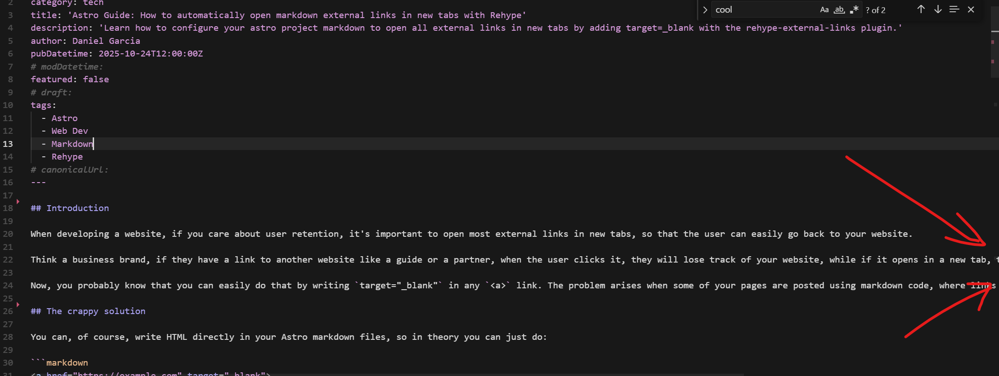
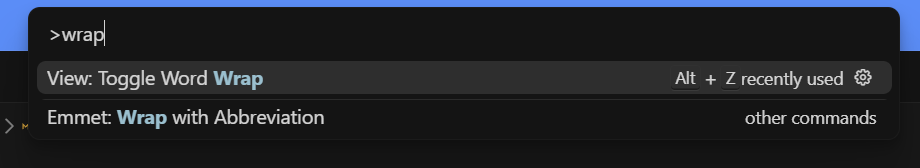

import WebsiteDesignCTA from '../../../components/common/websiteDesignCTA.tsx';

## Introduction

Ever had the following happen to you when writing markdown code on Cursor or VScode?

It's a pain specially when writing long form content like markdown files for your website blog for instance, and having to scroll horizontally constantly to see what's there.

## How to fix it

Before [the configuration for this](https://www.codewithshripal.com/tips/vs-code/how-to-word-wrap-mdx-files) was quite a pain. But later updates from Cursor and VSCode has made it super easy:

1. Go to your markdown file
2. Hit `F1` on your keyboard and type "Wrap"
3. Select the "View: Toggle Word Wrap" option:

That's it! You should be able to see all the text in your markdown file without having to scroll horizontally.

<WebsiteDesignCTA client:visible />
