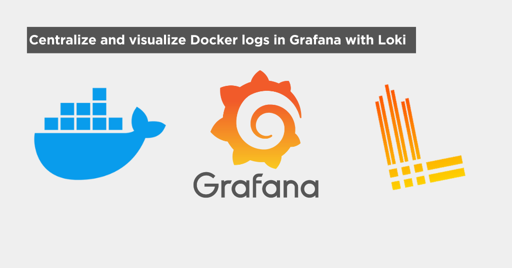

## Introduction

I've previously written about how to centralize and visualize logs in Grafana with Loki for apps that write logs to files [here](https://daniel.es/blog/how-to-centralize-and-visualize-your-app-logs-in-grafana/).

Doing the same with Docker is **SO MUCH SIMPLER**.

### My approach

You will see other guides showing you how to set up everything in a single machine. While this might be convenient for people running all their Docker stuff in a single server, it's not the best practice for a production environment.

I will show you how to set up everything in a way that you can scale horizontally. With Grafana, Loki and Promtail each running in isolation of each other.

I.e.: You can have promtail in a server running Docker containers for a web app, sending the logs to a Loki instance running in another server and then visualize everything in Grafana running in a third server.

## How does it work?

The set up is really similar to the one I wrote about in the previous article, but with a few differences:


The main difference is that, with this setup, we have the Docker daemon sending the logs directly to Loki, without having to configure Promtail at all!

This has a few advantages:

- You don't need to mess around with log files and their locations
- Docker takes care of sending the logs to Loki
- Querying the logs becomes **SO MUCH EASIER** in Grafana as we can query by container name, image, compose project, etc.

## 1. Setting up Loki

> If you already have a Loki instance and are only interested in setting up the Docker Loki plugin, you can skip this section.

As I said in the introduction, I like to set up everything in separate servers, so here's how I set up Loki in a Ubuntu server in my home lab.

Note that this setup also works if you want to do it all in one machine, it's just that you might want to set up loki and grafana in the same compose file.

### 1.1 Create a directory for our configuration files

```bash
cd && mkdir loki && cd loki
```

### 1.2 Create a `loki-config.yaml` file

```bash
nano loki-config.yaml
```

Paste the following content:

```yaml
# You can enable authentication to prevent unauthorized access to your logs
auth_enabled: false

server:
  # This is the port where Loki will receive logs from Docker (or Promtail)
  http_listen_port: 3100
  # This is the port where Loki will expose its API
  grpc_listen_port: 9096

common:
  instance_addr: 127.0.0.1
  path_prefix: /tmp/loki
  storage:
    filesystem:
      chunks_directory: /tmp/loki/chunks
      rules_directory: /tmp/loki/rules
  replication_factor: 1
  ring:
    kvstore:
      store: inmemory

query_range:
  results_cache:
    cache:
      embedded_cache:
        enabled: true
        max_size_mb: 100

schema_config:
  configs:
    - from: 2020-10-24
      store: tsdb
      object_store: filesystem
      schema: v13
      index:
        prefix: index_
        period: 24h

ruler:
  alertmanager_url: http://localhost:9093
```

### 1.3 Create a `docker-compose.yaml` file

```bash
nano docker-compose.yaml
```

Paste the following content:

```yaml
services:
  loki:
    image: grafana/loki:latest
    volumes:
      - ./loki-config.yml:/etc/loki/loki-config.yml
    ports:
      - '3100:3100'
    restart: unless-stopped
    command: -config.file=/etc/loki/loki-config.yml
```

> Even though you could run this single container with `docker run`, I like to use `docker-compose` so I don't have to remember the command to start the container.

### 1.4 Start Loki!

```bash
docker compose up -d
```

If everything went well, you should be able to access Loki at `http://your-server-ip:3100`.

If you have servers in multiple locations (aws, digital ocean, home lab, etc), you can create a reverse proxy with NGINX or a similar service to expose Loki to the internet. If so, I recommend either enabling authentication in the `loki-config.yaml` file or allowing only your servers to access Loki via the reverse proxy or firewall.

Now you can point all your Docker servers to point to this Loki instance!

## 2. Setting up the Docker Loki Docker plugin

I'll assume you already have one or multiple Docker containers running in a server somewhere.

You can repeat this step for every server you have running Docker containers.

### 2.1 Create the necessary files

What I like to do in my servers is to set up a directory only for this logging setup, so:

```bash
cd && mkdir promtail && cd promtail
```

In this directory you will need 2 files:

- `promtail-config.yaml`
- `docker-compose.yaml`

### 2.2 `promtail-config.yaml`

This file will tell Promtail where to look for the logs and where to send them.

```yaml
server:
  http_listen_port: 9080
  grpc_listen_port: 0

positions:
  # Temporary file to store the last read position for each log stream. Useful in case of a crash or restart.
  filename: /tmp/positions.yaml

clients:
  # The URL where your Loki instance is running
  - url: http://localhost:3100/loki/api/v1/push

scrape_configs:
  - job_name: docker
    pipeline_stages:
      - docker: {}
    static_configs:
      - labels:
          job: docker
          __path__: /var/lib/docker/containers/*/*-json.log
```

You can directly copy the code above, the only **important thing to change** is the `url` field in the `clients` section.

The code above assumes you will run a Docker container running Loki in the same server as Promtail (thus the `localhost`). I, for instance, have Loki in my home lab running behind a reverse proxy, so I would change this to `https://myloki.mydomain.com/loki/api/v1/push`.

### 2.3 `docker-compose.yaml`

```yaml
# docker-compose.yml

services:
  promtail:
    image: grafana/promtail:latest
    restart: unless-stopped
    volumes:
      - /var/log:/var/log
      - ./promtail-config.yml:/etc/promtail/promtail-config.yml
    command: -config.file=/etc/promtail/promtail-config.yml
```

This docker-compose file will start a Promtail container with the configuration file we just created.

### 2.4 Install the Docker loki plugin

This is the easiest part.

```bash
docker plugin install grafana/loki-docker-driver:2.9.2 --alias loki --grant-all-permissions
```

> Check [here](https://grafana.com/docs/loki/latest/send-data/docker-driver/) for the latest version of this command.

If the command was successful, you should see the plugin listed when you run `docker plugin ls`.

### 2.5 Configure the Docker daemon

We need to create a `daemon.json` file in `/etc/docker/` with the following content:

```json
{
  "log-driver": "loki",
  "log-opts": {
    "loki-url": "http://localhost:3100/loki/api/v1/push",
    "loki-batch-size": "400"
  }
}
```

This tells Docker that it should use the loki log driver instead of the default one and sends the logs to the Loki instance.

> Again, change the `loki-url` field to the correct URL for you.

`loki-batch-size` is optional, but I like to set it to 400 to avoid sending too many requests to Loki.

### 2.6 Wait, if the Loki plugin sends the logs, why do we need Promtail?

The Loki plugin will send the logs to Loki, but it won't keep track of the log position. This means that if Loki goes down, you will lose the logs that were sent while it was down.

Promtail will keep track of the log position and send the logs to Loki when it's back up.

### 2.7 Restart Docker

```bash
sudo systemctl restart docker
```

### 2.8 Start promtail!

```bash
cd ~/promtail && docker compose up -d
```

Great! Now we have all the Docker containers in this machine sending their logs to our Loki instance!

## 3 Grafana!

This is the final and coolest part!

### 3.1 Install Grafana

> If you already have Grafana set up, you can skip ahead to 3.3 where I show how easy is to query the logs.

It's as simple as running a container:

```bash
docker run -d --name=grafana -p 3000:3000 grafana/grafana
```

You can access Grafana at `http://your-server-ip:3000`.

### 3.2 Connect Grafana to Loki

1. In the left panel, go to "Connections" > "Data Sources".

2. Click on "+ Add new data source".

3. Search for "Loki":

   

4. Fill in a name and the url of your Loki instance:

   

5. Click on "Save & Test". You should see a message saying everything is working correctly.

   

### 3.3 Query the logs

1. In the left panel, go to "Explore".

2. Select your Loki source at the top:

   

3. 🎉 Now comes the super cool part of this setup. You can query the logs by container name, compose project, etc.:

   

   This is the best part of this setup, as you can really easily see the logs of a specific container without having to sort through hundreds of files and weird configurations.

## Conclusion

I love this setup, I deploy my stuff mainly with Docker and having all the logs centralized in a single place makes my life so much easier to debug and monitor.

Hope you found this guide useful! If you have any questions or suggestions, feel free to reach out to me on [Twitter](https://twitter.com/onticdani)!

Also, if you want to learn more about how to query Loki logs in Grafana, check out [this article](https://daniel.es/blog/how-to-query-logs-in-grafana-loki/).
