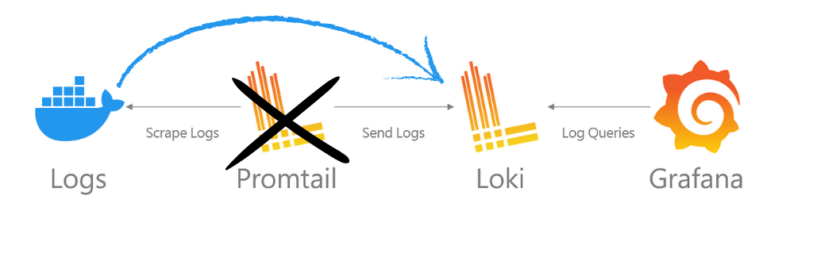
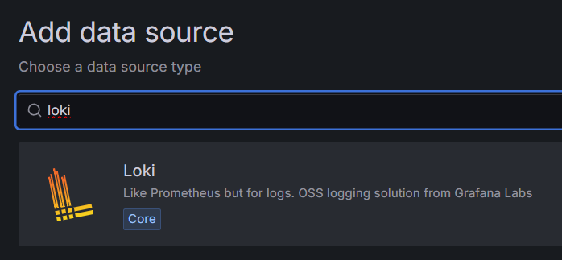
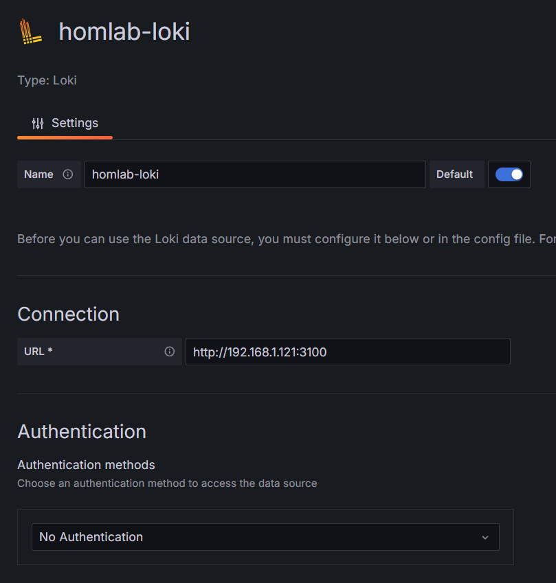
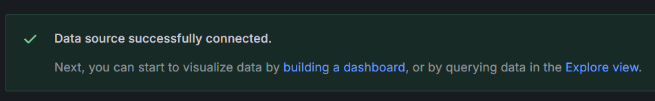
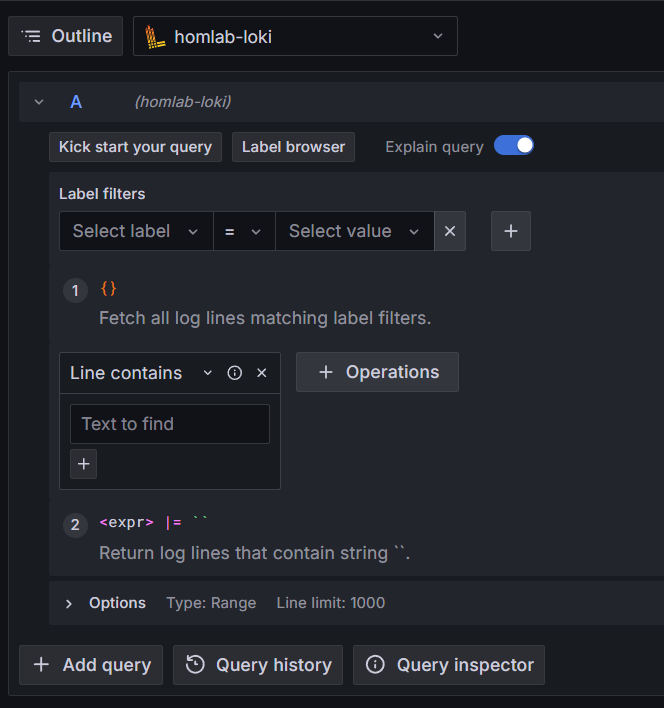
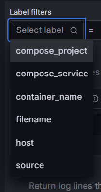

## Introduction

I've previously written about how to centralize and visualize logs in Grafana with Loki for apps that write logs to files [here](https://daniel.es/blog/how-to-centralize-and-visualize-your-app-logs-in-grafana/).

Doing the same with Docker is **SO MUCH SIMPLER**.

### My approach

You will see other guides showing you how to set up everything in a single machine. While this might be convenient for people running all their Docker stuff in a single server, it's not the best practice for a production environment.

I will show you how to set up everything in a way that you can scale horizontally. With Grafana, Loki and Promtail each running in isolation of each other.

I.e.: You can have promtail in a server running Docker containers for a web app, sending the logs to a Loki instance running in another server and then visualize everything in Grafana running in a third server.

## How does it work?

The set up is really similar to the one I wrote about in the previous article, but with a few differences:



The main difference is that, with this setup, we have the Docker daemon sending the logs directly to Loki, without having to configure Promtail at all!

This has a few advantages:

- You don't need to mess around with log files and their locations
- Docker takes care of sending the logs to Loki
- Querying the logs becomes **SO MUCH EASIER** in Grafana as we can query by container name, image, compose project, etc.

## 1. Setting up Loki

If you already have a Loki instance and are only interested in setting up the Docker Loki plugin, you can skip this section.

As I said in the introduction, I like to set up everything in separate servers (I use Proxmox LXCs for this), so here's how I set up Loki in a Ubuntu + Docker server in my home lab.

Note that this setup also works just fine if you want to do it all in one machine. Just set up the Loki and Grafana services in the same docker compose file.

### 1.1 Create a directory for our configuration files

```bash
cd && mkdir loki && cd loki
```

### 1.2 Create a `loki-config.yaml` file

```bash
nano loki-config.yaml
```

This is the configuration code for loki. I explain what each part does below.

```yaml
auth_enabled: false

server:
  http_listen_port: 3100

common:
  path_prefix: /tmp/loki
  instance_addr: 127.0.0.1
  storage:
    filesystem:
      chunks_directory: /tmp/loki/chunks
      rules_directory: /tmp/loki/rules
  replication_factor: 1
  ring:
    kvstore:
      store: inmemory

query_range:
  results_cache:
    cache:
      embedded_cache:
        enabled: true
        max_size_mb: 100

schema_config:
  configs:
    - from: 2020-05-15
      store: tsdb
      object_store: filesystem
      schema: v13
      index:
        prefix: index_
        period: 24h

ruler:
  alertmanager_url: http://localhost:9093

analytics:
  reporting_enabled: false

limits_config:
  retention_period: 30d

compactor:
  working_directory: /tmp/loki/retention
  delete_request_store: filesystem
  retention_enabled: true
  retention_delete_delay: 2h
```

#### What does each part do?

- ```yaml
  auth_enabled: false
  ```

  If Loki requires authentication or not. If you're exposing Loki through a reverse proxy or something similar to the internet, you should enable this.

- ```yaml
  server:
    http_listen_port: 3100
  ```

  The port where Loki will receive logs from Docker (or Promtail) and also make them accessible to Gragana.

- ```yaml
  common:
    path_prefix: /tmp/loki
    instance_addr: 127.0.0.1
    storage:
      filesystem:
        chunks_directory: /tmp/loki/chunks
        rules_directory: /tmp/loki/rules
    replication_factor: 1
    ring:
      kvstore:
        store: inmemory
  ```

  This section tells Loki to store everything in the `/tmp/loki` directory.

  That it is running in the local machine (127.0.0.1) and that it should use the `filesystem` (which just means the local disk) as the storage engine.

  We also tell it to just save 1 replica of the data and that it should use an in-memory ring to store the data until it's saved to disk.

- ```yaml
  query_range:
    results_cache:
      cache:
        embedded_cache:
          enabled: true
          max_size_mb: 100
  ```

  This section tells Loki to cache the results of queries in memory. This is optional, but I like to have it enabled since it improves performance when querying the logs from Grafana.

  The `max_size_mb` is the maximum size of the cache in megabytes. The docs state 100 MB is a good starting point, adjust this as needed.

- ```yaml
  schema_config:
    configs:
      - from: 2020-05-15
        store: tsdb
        object_store: filesystem
        schema: v13
        index:
          prefix: index_
          period: 24h
  ```

  This is the schema for the logs. It tells Loki to accept logs from a specific date onwards (I usually just set a random date in the past since all my logs will be from the here on out).

  It tells it to use the `tsdb` storage engine (time series database). We also tell it to use the `filesystem` to store other data.

  In the index section, we tell Loki to use the `index_` prefix for the index files and to do so every 24 hours.

- ```yaml
  ruler:
    alertmanager_url: http://localhost:9093

  analytics:
    reporting_enabled: false
  ```

  Here we're telling Loki to use the local alertmanager instance and to not report any analytics since I'm not going to use them.

- ```yaml
  limits_config:
    retention_period: 30d

  compactor:
    working_directory: /tmp/loki/retention
    delete_request_store: filesystem
    retention_enabled: true
    retention_delete_delay: 2h
  ```

  Finally, we tell Loki to keep the logs for 30 days and to delete older logs. We set a delay of 2 hours for the deletion.

  Note that `limits_config` won't work unless we set up the compactor. The compactor does what the name sugests, it compacts the logs into chunks and is in charge of deleting old data.

### 1.3 Create a `docker-compose.yaml` file

```bash
nano docker-compose.yaml
```

Paste the following content:

```yaml
services:
  loki:
    restart: unless-stopped
    image: grafana/loki:latest
    ports:
      - '3100:3100'
    volumes:
      - ./loki-config.yml:/etc/loki/local-config.yaml
      - loki-data:/loki
    command: -config.file=/etc/loki/local-config.yaml

volumes:
  loki-data:
```

Here we expose the http port for Loki and tell Docker to use the `loki-config.yaml` file for the configuration.

We also create a volume for the data generated by Loki so it can persist even if the container is removed.

> Even though you could run this single container with `docker run`, I like to use `docker-compose` so I don't have to remember the command to start the container.

### 1.4 Start Loki!

```bash
docker compose up -d
```

If everything went well, you should be able to access Loki at `http://your-server-ip:3100`.

If you have servers in multiple locations (aws, digital ocean, home lab, etc), you can create a reverse proxy with NGINX or a similar service to expose Loki to the internet. If so, I recommend either enabling authentication in the `loki-config.yaml` file or allowing only your servers to access Loki via the reverse proxy or firewall.

Now you can point all your Docker servers to point to this Loki instance!

### 1.5 Exposing Loki to the internet

If all your Docker servers are running in the same network, just note down the IP address of the server running Loki.

If your Docker servers are running in an external server to where you installed Loki (i.e. Loki is in your Home Lab at home and your Docker server is in a cloud provider), you can expose Loki to the internet by running a reverse proxy.

I won't go into detail on how to do this, there are many guides on using NGINX, Traefic, Cloudflare tunnels, etc. Just use what you're comfortable with.

## 2. Setting up the Loki Docker plugin

I'll assume you already have one or multiple Docker containers running in a server somewhere.

You can repeat this step for every server running Docker.

### 2.1 Install the Docker loki plugin

This is the easiest part. Run the following command:

```bash
docker plugin install grafana/loki-docker-driver:2.9.2 --alias loki --grant-all-permissions
```

> Check [here](https://grafana.com/docs/loki/latest/send-data/docker-driver/) for the latest version of this command.

If the command was successful, you should see the plugin listed when you run `docker plugin ls`.

### 2.2 Configure the Docker daemon

Now we need to tell Docker to use the Loki plugin to send the logs to Loki.

We need to create a `daemon.json` file in `/etc/docker/` with the following content:

```json
{
  "log-driver": "loki",
  "log-opts": {
    "loki-url": "http://localhost:3100/loki/api/v1/push",
    "loki-batch-size": "400"
  }
}
```

This tells Docker that it should use the loki log driver instead of the default one and sends the logs to the Loki instance.

> Again, change the `loki-url` field to the correct URL for you.

`loki-batch-size` is optional, but I like to set it to 400, meaning it will send 400 logs at a time to Loki. Not too many, not too few.


### 2.3 Restart Docker

This is the command for Ubuntu/Debian. If you're on a different OS, just Google how to restart the Docker service for your OS.

```bash
sudo systemctl restart docker
```

Great! Now we have all the Docker containers in this machine sending their logs to our Loki instance!

## 3 Grafana!

This is the final and coolest part!

### 3.1 Install Grafana

> If you already have Grafana set up, you can skip ahead to 3.3 where I show how easy is to query the logs.

It's as simple as running a container:

```bash
docker run -d --name=grafana -p 3000:3000 grafana/grafana
```

You can access Grafana at `http://your-server-ip:3000`.

### 3.2 Connect Grafana to Loki

1. In the left panel, go to "Connections" > "Data Sources".

2. Click on "+ Add new data source".

3. Search for "Loki":

   

4. Fill in a name and the url of your Loki instance:

   

5. Click on "Save & Test". You should see a message saying everything is working correctly.

   

### 3.3 Query the logs

1. In the left panel, go to "Explore".

2. Select your Loki source at the top:

   

3. 🎉 Now comes the super cool part of this setup. You can query the logs by container name, compose project, etc.:

   

   This is the best part of this setup, as you can really easily see the logs of a specific container without having to sort through hundreds of files and weird configurations.

## Conclusion

I love this setup, I deploy my stuff mainly with Docker and having all the logs centralized in a single place makes my life so much easier to debug and monitor.

It's also SUPER simple to query specific logs, if I need to see the logs of a full compose project, or a specific service or container, I can do it with a simple query.

Hope you found this guide useful! If you have any questions or suggestions, feel free to reach out to me on [X](https://x.com/onticdani)!
