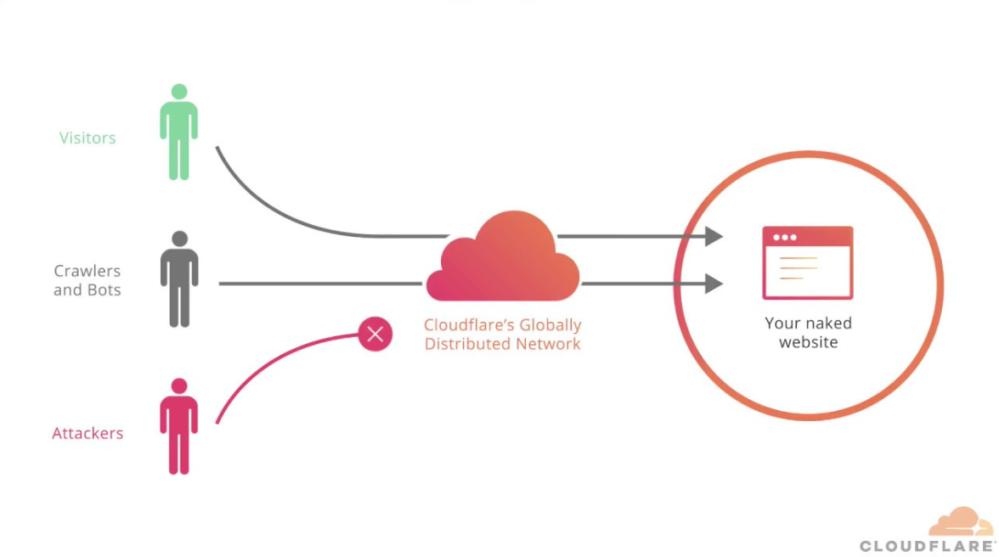

## Introduction

In the past few months there's been a war over internet censorship in Spain.

[Javier Tebas](https://wikipedia.org/wiki/Javier_Tebas), president of La Liga (Spain's top footabll league) together with Movistar Plus (Streaming service owned by Spain's top telecomunications company Telefónica), have taken their war on illegal football streaming to a new level.

They recently asked a judge to [authorize all Spanish ISPs to instantly block any IP addresses](https://www.poderjudicial.es/search/AN/openDocument/766326fb999ba14aa0a8778d75e36f0d/20250331) that La Liga deems necessary - at any time - with only one condition: It **must not affect third parties** (forshadowing...).

## What's the problem then?

Before a football match, La Liga will identify a list of sites that they believe are streaming illegaly and write down the IP addresses of the servers of those sites.

The problem is... those sites use services like Cloudflare, Vercel, Netlify content delivery networks (CDN's) to serve their content. These CDN's protect your site from being attacked, improving speed and enhancing privacy, as they hide the real IP of the server (which these streaming sites take advantage of).

The thing is that these CDN's are composed of a list of IP's that are distributed around the world. A single IP can host **[millions](https://x.com/jaumepons/status/1912234218119168345)** of websites and applications.

Sites like X (Twitter), Twitch, LinkedIn, Steam, AI providers and many businesses (including mine) are being affected by this.

## The timeline

- **2024-Dec-18**: The judge from the Commercial Court No. 6 of Barcelona passes the [order that allows La Liga to block any IP they want](https://www.poderjudicial.es/search/AN/openDocument/766326fb999ba14aa0a8778d75e36f0d/20250331).

- **2025-Feb-09**: La Liga initiates their first major blocking action, blocking Cloudflare IP addresses and causing major disruptions in Spain.

- **2025-Feb-15**: After some outroar online, La Liga [releases an official statement](https://www.laliga.com/en-GB/news/official-statement-in-relation-to-the-blocking-of-ips-during-the-recent-ea-sports-laliga-matchdays-linked-to-illegal-cloudflare-practices), where they double down and accuse Cloudflare of knowingly protect illegal and criminal organizations (including tr@ffick!ng, pr0st!tut!0n and ch!ld p0rn0gr@phy).

- **2025-Feb-19**: Cloudflare, together with RootedCON (a Spanish cybersecurity organisation) appeal the order to the same Court. Stating that the measures taken were being disproportionate and were blocking millions of users from accessing unrelated, legitimate websites and services.

- **2025-Feb-23**: The Objective [releases an interview](https://theobjective.com/actualidad/2025-02-23/javier-tebas-purgatorio/) with Javier Tebas where he says that [only "4 nerds" are complaining about it](https://x.com/JaimeObregon/status/1921553141335466270) and only piracy, illegal and criminal sites are affected.

- **2025-Mar-26**: Cloudflare and RootedCON [lose the appeal](https://x.com/jaumepons/status/1904906677335245294) against the initial order. La Liga does a [press release](https://www.laliga.com/noticias/el-juzgado-de-lo-mercantil-no-6-de-barcelona-respalda-la-sentencia-dictada-a-favor-de-laliga-y-desestima-las-nulidades-instadas-por-cloudflare-y-rootedcon) saying that the judge has not seen proof of third parties being affected by the block.

- **2025-Apr-15**: Guillermo Rauch, CEO of Vercel, [speaks out](https://x.com/rauchg/status/1912218989872472489) about the issue and how it's affecting his company. He also clarifies that La Liga has never contacted them to discuss the issue, just blocked their IPs without any prior warning. La Liga agrees to open a communication channel for them to report any sites and not block Vercel's CDN IPs.

- **2025-May-11**: Guillermo Rauch, CEO of Vercel, says that even after talking with La Liga and opening a dedicated communication channel for them to report any sites, [they are still being blocked indiscriminately](https://x.com/rauchg/status/1921603136705458339).

- **2025-May-13**: Spanish news outlets finally [begin to cover this story more widely](https://x.com/patowc/status/1922173002193445338).

## How to check if your service is affected by La Liga IP block

Check if your service is affected by going to [Hay Ahora Futbol](https://hayahora.futbol/).

Note that even if that site says the service is not affected, it doesn't mean it's not. It just means that it's not on the tracked IP list, as this list varies from week to week and requires a high maintenance effort to keep up to date.

If you want to take action, take a screenshot and read [what you can do about it](#what-can-we-legally-speaking-do-about-it) below.

## I can't use "x" service, what can I do?

The most inmediate thing you can do to access an affected service is to **just use a VPN**.

## What can we, legally speaking, do about it?

Seeing how the judge that passed the order and refused the appeal from Cloudflare might be corrupted and influenced by Javier Tebas, there are a couple of routes:

- Elevate this case to the consitutional court of Spain (hard)
- Create a law suit against La Liga and Javier Tebas if your company is affected (medium)
- Complain en-masse to the European Commission (easy)
- Make noise on social media and in the press so that more people are aware of this issue (easy)

The first one has not yet been carried out by anyone due to the energy, money and time that it requires.

The rest depend on all of us.

### How to send a complaint to the European Commission

1. Go to [https://ec.europa.eu/law/application-eu-law/report-breach/es/check-your-criteria](https://ec.europa.eu/law/application-eu-law/report-breach/es/check-your-criteria)

2. **Check if your complaint is valid** - You will be asked a series of questions to confirm if the Commission is competent in your case. For example:

   - Is the complaint against an EU country? ✅ (Yes, in this case Spain).
   - Is it against an incorrect application of EU law? ✅ (Yes, for possible violation of Regulation 2022/612)

3. **Click on “Make a complaint”** - Once you confirm the criteria, you will see a button that allows you to start the process.

4. **Fill in the form** - You will have to fill in the following:

   - Your personal details (you can keep them confidential)
   - The national authority involved (e.g. Ministry of Culture, CNMC, courts or even internet providers)
   - A clear description of the facts: explain how the massive IP blocking affects legitimate sites that you use, without being related to piracy.
   - Cite the regulation you consider violated: Regulation 2022/612, articles on net neutrality and non-discriminatory access to the internet.

5. **Attach evidence if you have it** - If you can, include screenshots, lists of affected IPs, communications with your provider, etc.

6. **Submit the complaint** - After reviewing everything, you can submit the form and you will receive a reference number. The Commission will assess whether to initiate infringement proceedings against the Member State.

(Visit [revistacloud.com](https://revistacloud.com/como-presentar-una-denuncia-ante-la-comision-europea-si-crees-que-el-bloqueo-de-ips-en-espana-vulnera-tus-derechos-digitales/) for more details on the process)

## My take on this

There is no doubt that third parties being affected by this, in itself, is quite bad. But there is a bigger, higher level issue:

> People with influence can actively pass illegal measures and there is nothing the public can do about it.

This type of unjustified, country-wide internet censorship should not be possible or tolerable. Especially when so many businesses are being affected.

> It's not that they are doing it, it's that they **CAN** do it

We shouldn't let high ranking people, corrupt judges/politicians or any other person with power pass illegal measures like these without consequences.

## Acknowledgements

- [Alejandro](https://x.com/iamzenitram) for making the [Hay Ahora Futbol](https://hayahora.futbol/) site.
- [Jaume](https://x.com/jaumepons) for being actively speaking out and tracking all the IPs and services being blocked.
