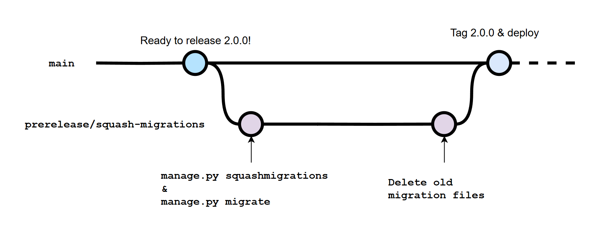

import NewsletterSignup from '~/components/common/newsletterSignup';

## Introduction

If you've dealt a lot with django migrations, you've probably encountered a situation where you have tens of migrations and you don't know at which point you introduced each one of them or needed to downgrade your application for some reason and it all became a mess.

Not only that but deployments become a bit of a "wing it" situation when it comes to migrating new model changes.

If you want to learn how to organize and squash your django migrations, you came to the right place.

<NewsletterSignup client:visible />

## What is "squashing migrations"

Feel free to skip this section if you're already familiar with the concept.

Squashing is a way of organizing your django migrations. It helps you consolidate those migrations you made like this:

You coded a lot of new model changes and suddenly have the following migrations in your app:

- 0002_did_something.py
- 0003_did_something_else.py
- 0004_did_something_else_2.py
- 0005_did_something_else_3.py

But you all of those will be released in the same deployment of your application, so you ideally want to squash them into a single migration file:

- 0002_release_1.py

This way not only can you keep your migrations clean and easy to manage, but also allow you to easily revert them if needed in an easier way.

## Why would I want to squash migrations?

There are a few reasons why you might want to squash migrations:

1. You want to keep your migrations clean and easy to manage.
2. You want to easily revert them if needed.
3. You want to deploy a new version of your application with the migrations you made.

I personally do this every time before a deployment of a new version, so I know exactly what migrations were deployed in what version of my application and it allows me to:

1. Identify in what version any issue happened
2. If something goes wrong with a new deployment I can easily revert the database to the migration of the previous deployment version

### Avoid deleting old migrations

You might be tempted to just:

1. Revert all the migrations you've done since the last deployment
2. Delete those migrations
3. Rerun the `manage.py makemigrations` command
4. Run the `manage.py migrate` command

**Reasons why this is <u>not</u> a good idea:**

- You might have some migrations that you modified manually, for instance, if you wrote custom logic in the `forward` or `backward` methods. By deleting them you might lose critical details in those changes.
- If you work in a team, doing that **WILL** screw up your teammates' local databases and they will need to re-create them.

Squashing migrations is way better cause you maintain the history of past migrations and ensure you don't break anything. So let's get into how to do it.

## How to squash migrations

There are 2 scenarios when it comes to squashing migrations:

1. [Squashing migrations that you haven't really deployed yet](#squashing-migrations-that-you-havent-deployed-yet)
2. [Squashing migrations that you already released or deployed](#squashing-migrations-that-you-already-released-or-deployed)

Let's dive into each of them.

### Squashing migrations that you haven't deployed yet

This is the easiest, since your production database hasn't received any of the migrations yet.

#### 1. Identify the migrations you want to squash.

```bash
python manage.py showmigrations
```

For example, let's say you have the app `myapp` with the following new migrations for your version 2.0.0 and you want to squash them into a single migration file:

- 0002_did_something.py
- 0003_did_something_else.py
- 0004_did_something_else_2.py
- 0005_did_something_else_3.py

#### 2. Squash the migrations using the `squashmigrations` command.

```bash
python manage.py squashmigrations myapp 0002 0005
```

This will squash all the migrations from 0002 to 0005 into a single migration file called `0002_whatever.py`.

Note that in this step you can give a custom name to your squashed migration file like this:

```bash
python manage.py squashmigrations myapp 0002 0005 --squashed-name release_2_0_0.py
```

This will squash all the migrations from 0002 to 0005 into a single migration file called `0002_release_2_0_0.py`.

#### 3. Migrate your database

Once you have your squashed migration, **DO NOT** delete the old migrations just yet!

You should commit the changes like this and migrate to your dev database with the new squashed migration:

```bash
python manage.py migrate
```

> Why commit the changes?
>
> Because that commit will be needed by your teammates to migrate their local databases.

#### 4. Now you can delete the old migrations

After you migrated your changes to the dev database you can delete the old migrations and remove the `replaces` clause from the squashed migration file.

#### 5. Done! You can now deploy your changes

You can now deploy your changes and migrate your production database with the new squashed migration in your production environment:

```bash
python manage.py migrate
```

---

### Squashing migrations that you already released or deployed

This follows the same first steps as the previous section, but you'll need to migrate to your production database BEFORE deleting the old migrations:

#### 1. Identify the migrations you want to squash.

```bash
python manage.py showmigrations
```

For example, let's say you have the app `myapp` with the following new migrations for your version 2.0.0 and you want to squash them into a single migration file:

- 0002_did_something.py
- 0003_did_something_else.py
- 0004_did_something_else_2.py
- 0005_did_something_else_3.py

#### 2. Squash the migrations using the `squashmigrations` command.

```bash
python manage.py squashmigrations myapp 0002 0005
```

This will squash all the migrations from 0002 to 0005 into a single migration file called `0002_whatever.py`.

Note that in this step you can give a custom name to your squashed migration file like this:

```bash
python manage.py squashmigrations myapp 0002 0005 --squashed-name release_2_0_0.py
```

This will squash all the migrations from 0002 to 0005 into a single migration file called `0002_release_2_0_0.py`.

#### 3. Migrate your dev and production databases

Once you have your squashed migration, **DO NOT** delete the old migrations just yet!

You should commit the changes like this and then migrate both your dev and production databases:

```bash
python manage.py migrate
```

#### 4. Now you can delete the old migrations

After you migrated your changes to all your databases, it is safe to delete the old migrations.

You will also need to remove the `replaces` clause from the squashed migration file.

After this, commit these new changes and re-deploy your application.

#### 5. Done!

As you can see, the process is the same, we just need to make sure the production database has the old migrations when migrating so it understands what migrations the new squashed migration is replacing.

## My git workflow for squashing migrations in django

This git workflow might vary depending on my needs or project, but it mainly follows this flow:



In the case where you are squashing migrations that you already released or deployed, the git workflow is the same. You just want to deploy the commit where you run the `manage.py squashmigrations` command, then proceed with the rest of the git workflow and re-deploy your application.

## Conclusion

Squashing migrations is a great way to keep everything organized. It's super simple to execute and it will eventually save you a big headache in the future.

I hope this helps you keep your migrations clean and easy to manage.

Feel free to shoot me a line on [X](https://x.com/onticdani).

## Acknowledgements

- <a href="https://docs.djangoproject.com/en/5.1/topics/migrations/#squashing-migrations" rel="nofollow noreferrer">
    Django Migrations
  </a>
- <a href="https://jacklinke.com/squashing-django-migrations-the-easy-way" rel="nofollow noreferrer">
    Squashing Django Migrations the Easy Way
  </a>
