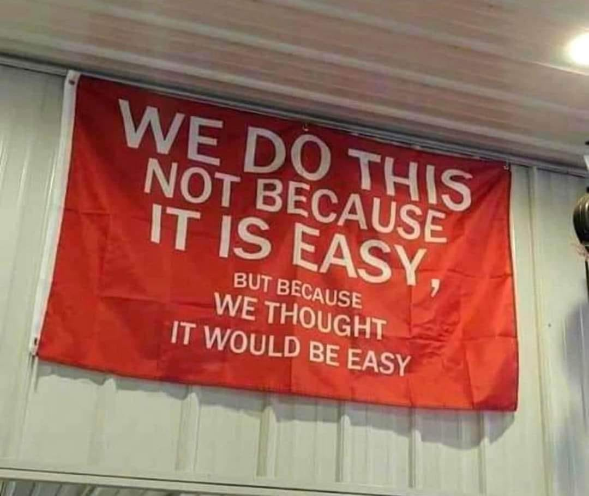

import WebsiteDesignCTA from '../../../../components/common/websiteDesignCTA.tsx';

## Introduction

As any entrepreneur has probably experienced, when we begin trying to find something to build, we are stuck by a total lack of ideas. This is caused mostly because of the mentality at our previous jobs, our brains are not trained to really find solutions to problems constantly.

As we begin to gain traction throughout our journey, the opposite starts happening. Suddenly, every day, on every interaction, we come up with new ideas. And it's clear why this happens, we've switched gears and, suddenly, our brain is wired to solve problems.

Now, whenever we identify a problem, our brain begins a rapid-fire-idea-frenzy to fix that problem. This is what I call "The idea avalanche".

<WebsiteDesignCTA client:visible />

## Understanding the Idea Avalanche: Why entrepreneurs struggle

To solve a problem you first need to identify it.

Some people don't actually have a problem with this, but some do, and it's important to identify how and why we struggle with this.

Having ideas is not the issue, the problem comes when those ideas stop you from moving forward towards the goals that actually matter.

There was a period where I used to get blocked by the overwhelm. I was working on something, but suddenly there were these new 4 or 5 ideas that seemed more attractive, easier even, than the venture I was currently doing.

There were a couple of times where I made the error of pursuing some of these straight away. They were so good, how could I NOT pursue them?

This is the issue with the Idea Avalanche, not that you have it, but that you are actually acting on it without even thinking it through.

## The Execution Gap: Get unstuck

There are two types of "stuck" here:

1. You might actually be wanting to start something, but there are so many things, which one should you chose?
2. You are actually pursuing something already, but it's getting complicated and you have 3 new ideas that seem sooo much better

### Just start and get going

If you are just starting, you might feel stuck in an endless decision loop.

Here's my advice: **Just. Pick. Something.**

If you're just starting out chances are that [your startup or project is not going to make it](#todo). Your friend is not going to know if it's a good idea. Hell, Jeff Bezos is not going to know if it's a good idea. There was a Boston VC, the guys that literally get paid to know what ideas are good, that rejected investing in Facebook early on, surely they thought: "FaceBook is such a shitty idea". An [idea is worth nothing until you actually make it work](#todo).

So it's much more efficient if you just pick something, pick it up with all the motivation in the world, fail fast, and iterate.

By doing this you will gain both skills and knowledge that help you iterate and move faster the second, third and fourth times around.

### Focus, don't lose track

The other type of stuck is even worse, because it doesn't feel like "stuck".

This is where you have an ongoing project, it might have not taken off and you are feeling unmotivated or you might have build it and not done any marketing for it yet. Suddenly, this new, fresh and shiny idea comes along. "Oh I should really build this!" you start to think. **Please DO NOT DO THAT**.

I've made this error, and I keep making it. New ideas are worth so much less than your current one. Why? Because you are already building something, you might have some traction, [you have data](#todo). You can iterate on your current project, on your niche, and be higher on the entrepreneurship stairs. Otherwise, you're starting from zero again.

Going for a new idea in this scenario is a form of procrastination. You're avoiding what you don't like to do (marketing, sales, talking to people...) by going for the new shiny thing, because you like building stuff and the motivation it brings.

Building something new brings that kind of motivation because, at first glance, it appears to be easier or better than the current project you're on. I hate it to break it to you, but that thing is going to end up at the same place that you are right now:

> Doing something new feels like it's going to be easier, when in reality it's not.

Focus on [finishing things](#todo) before starting a new idea. This means building something up until it runs by itself, selling it or some kind of exit. This also means [closing something down when needed](#todo), but you **SHOULD NOT** do this because you have another idea, you should do it because it's time and you need to.

## Finding Balance: Managing Creative Energy

Again, having ideas is not inherently bad, you just need to learn how to manage it.

For me, this meant writing ideas down in my notes app whenever I had one. This frees space in your brain for what actually matters and it also calms you down, knowing that you can come back to it in the future. I now have a list of dozens of ideas and I know I will never get to all of them, which is one more reason you shouldn't pursue every idea that comes your way.

Not pursuing ideas is hard because there is a feeling of "loss". By not acting on a new idea you are actively letting it go, which feels bad, really bad, how can you let go of such a good idea?

This is not easy and it's something I struggle with from time to time still. Just be mindful of this fact, note your idea down, and go back to your focus. That note will come in handy whenever you find the closure to your current project.

You will also find that there will be moments when you think how something could be done for one of these "standby ideas", that's also cool, it's your creative brain working. Just go back to your notes and note it down without acting on it.

And the coolest part? You will find that some of these things actually help you solve some problems or improve your current project.

## Conclusion: Creating Your Execution Roadmap

On you current project, create an execution roadmap. Define your goals (realistically if possible) and the situation where you would need to close down your project (realistically as well i.e.: if I spend 3 years, I'm below X MRR and and there's no progress).

Make the later non-negotiable to avoid abandoning your project for something else with the excuse that "it wasn't going anywhere anyway".

To sum everything up:

We all go through this - at first you can't come up with any ideas, and then suddenly they're everywhere. This "idea overflow" isn't bad by itself, but it can really mess up what you're currently working on.

- Your brain will start seeing problems and solutions everywhere - that's just how entrepreneurs work
- When you're starting out, just pick something and go with it instead of getting stuck thinking about it
- If you're already building something, don't let new ideas distract you - that's just you trying to avoid the hard stuff
- Write down your ideas somewhere so you can check them out later
- Set clear rules about when to keep going or quit a project, and stick to them no matter what new idea pops up

Here's the thing: ideas are everywhere, but you only have so much time and energy. Take care of them, and you'll get much further in your entrepreneurial journey.
