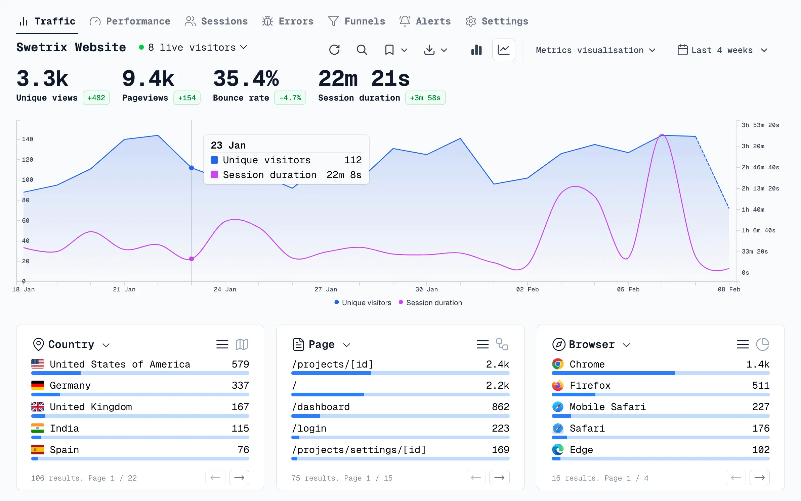

import WebsiteDesignCTA from '../../../../components/common/websiteDesignCTA.tsx';

## Introduction

Wait... there are alternatives to Google Analytics?

Yes, and you should probably, like 99% sure, use them instead.

<WebsiteDesignCTA client:visible />

## Why you should use an alternative to Google Analytics

Here are a couple of reasons:

1. They're GDPR compliant and you won't need to have a cookie banner (this alone convinced me to switch).
2. Most of them are self-hosted, so they are free and you own your data.
3. Google Analytics is overkill for 99% of the websites out there. If you just want to know number of visits, location, browser, referrers, etc. there are plenty of alternatives that are much more privacy-friendly.
4. You're sharing your visitors' data to Google, and we all know how much they care about privacy.

## List of Google Analytics alternatives

Here are some of the most popular Google Analytics alternatives.

> Note:
>
> This article is **super** opinionated based on my experience and research. If you have the time, I would suggest going into each of the service's docs and have a quick read through to gather your own opinions.
>
> I also ordered them by my preference, but I'll go a bit into the details I know about each one.

### Umami

This is the one I'm using right now and I **L O V E** it.

[Umami](https://github.com/umami-software/umami) is written in Next.js and React, with a PostgreSQL database. I'm familiar with all of these, which is one of the factors that made me choose it.

They maintain a `docker-compose.yml` file in their GitHub repository so it's super easy to set up. I actually have this running on a 2 core, 2GB RAM server at home and it's barely using any resources:

I reckon you'll be completely fine running this on a raspberry pi.

Not only that but the UI and UX are great. Super simple to set up a new site and navigate trough the analytics. They have features like comparing current period with the previous one, see detailed data about sessions, or track certain events.

Because the data is in PostgreSQL, it's quite easy to do whatever you want with it, like exporting or doing custom reports, though they have a feature to do reports from their UI as well.

One think that I also love is that you can use the following environment variables to rename the `js` script and API endpoint to whatever you want, helping you avoid being blocked by ad blockers:

- `COLLECT_API_ENDPOINT`
- `TRACKER_SCRIPT_NAME`

The set up for your website is also great. They give you a single-line script code you copy in your website's `<head>` tag and that's it!

One thing to keep in mind with Umami is that it doesn't use the fastest or most efficient tech stack. Which can be a problem if you are The NY Times or something, but I'm yet to have an issue with it.

### Swetrix

[Swetrix](https://github.com/Swetrix/swetrix)
has also a great UI:

Their features are similar to Umami but they have some more "enterprise grade" features like error and updatime monitoring, funnel analysis, alerts, etc.

Their tech stack also include Clickhouse instead of PostgreSQL, which makes their infrastructure a bit more complex and more resource-hungry. For reference, [they recommend running Clickhouse on at least 32GB of RAM](https://clickhouse.com/docs/operations/tips#using-less-than-16gb-of-ram).

I would say, if you are a super big enterprise company, then go with Swetrix, but for the rest of us, Umami is more than enough.

They are also doing some cool stuff to differentiate themselves from the rest. And they have a public [roadmap](https://github.com/orgs/Swetrix/projects/7), so you can see what they have in the works.

### Vince

Before trying Umami, [Vince](https://github.com/vinceanalytics/vince) was the first Google Analytics alternative I used. It's made by a solo dev:

It ran great, but in the end, the project seems to be still in an early stage, it has like half the features of Umami.

It's also not as popular as others, which means it doesn't receive many pull requests from the community and, because it's made by a solo dev, it's not as maintained.

It has a lot of potential though, so I'll keep an eye on it.

The script they give you to add to your website is suuuuper small, less than 1KB. Which makes it quite lightweight and fast.

### Plausible

One of the more mature tools here is [Plausible](https://github.com/plausible/analytics), well known and big projects in this list.

It's the big brother of Vince. In fact, Vince is a fork of Plausible that aimed to un-limit the number of sites and events you can track while also removing database dependencies, which is why I put it below Vince on the list.

The reason I put Plausible low on the list is because, again, it seems to be catered more towards enterprise while gatekeeping some features for their paid plans (which is totally fair).

It also uses Clickhouse as their database, which I'm not as familiar with and it's more of a hassle to maintain.

### GoatCounter

For a straightforward kind of "old school" Ui, you can try [GoatCounter](https://github.com/arp242/goatcounter):

The reason I put it so low is because they don't have a docker image. While probably faster without Docker, it's not as easy to set up as the other ones and I don't feel as comfortable if I needed to migrate something one day.

The last version was also released in December 2023, though their GitHub does seem active.

### Worthy mentions

#### Matomo

With a really active community, [Matomo](https://github.com/matomo-org/matomo) has become SUPER popular in the last few years.

But if said Plausible and Swetrix were more tailored towards the enterprise market, Motomo is even more so.

It's quite complex to set up and definitely not as user friendly for entrepreneus and indie hackers as the other ones in the list.

That being said, I haven't used it myself, this opinion comes from their docs and some comments on Reddit.

#### PostHog

I love the [PostHog](https://github.com/PostHog/posthog) guys. In fact, I learned a lot about business from their blog. They are super active in the community and they have a great product.

The thing is that PostHog is made to track... everything.

It works for web analytics but it's like using a Bugatti to go to the grocery store. You can definitely do it, but it's not the most efficient way to do it.

I would personally say leave PostHog for when you have a big business and want to track tons of metrics, not only on your website, but also on your app, backend, etc.

#### Fathom

Another great project is [Fathom](https://github.com/usefathom/fathom), but their self hosted version is quite lacking compared to the other ones. It also hasn't been updated in 2 years.

## References

- [Umami vs Plausible vs Matomo for Self-Hosted Analytics](https://aaronjbecker.com/posts/umami-vs-plausible-vs-matomo-self-hosted-analytics/)
