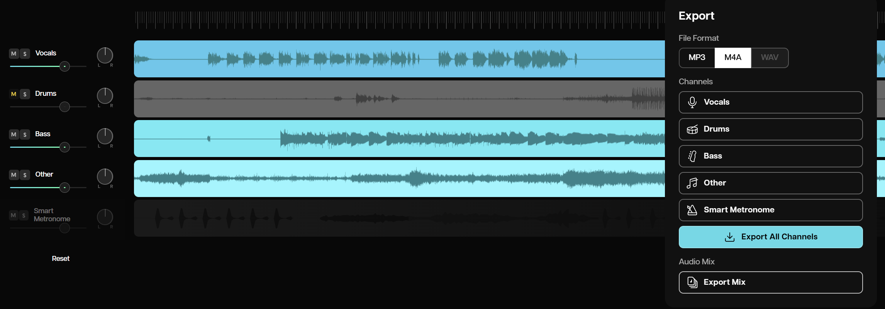
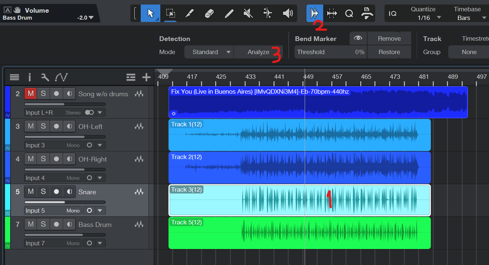
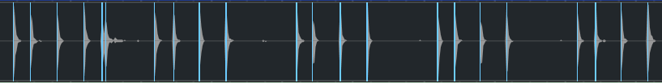
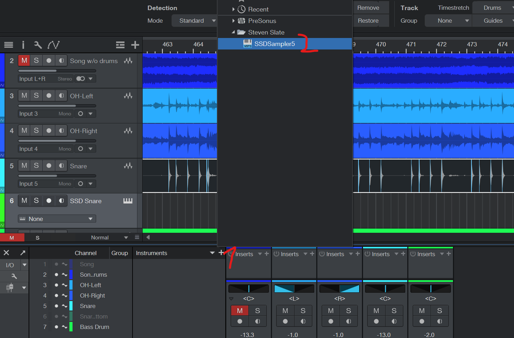
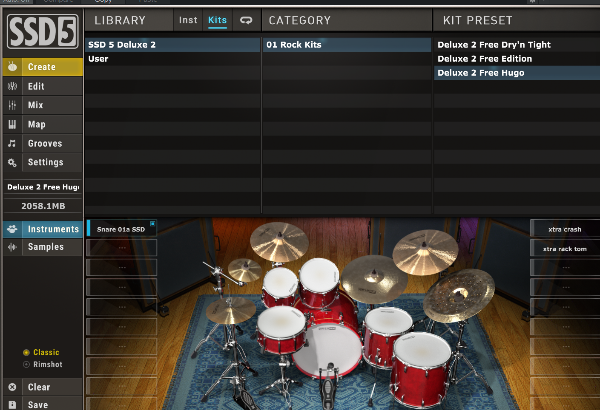
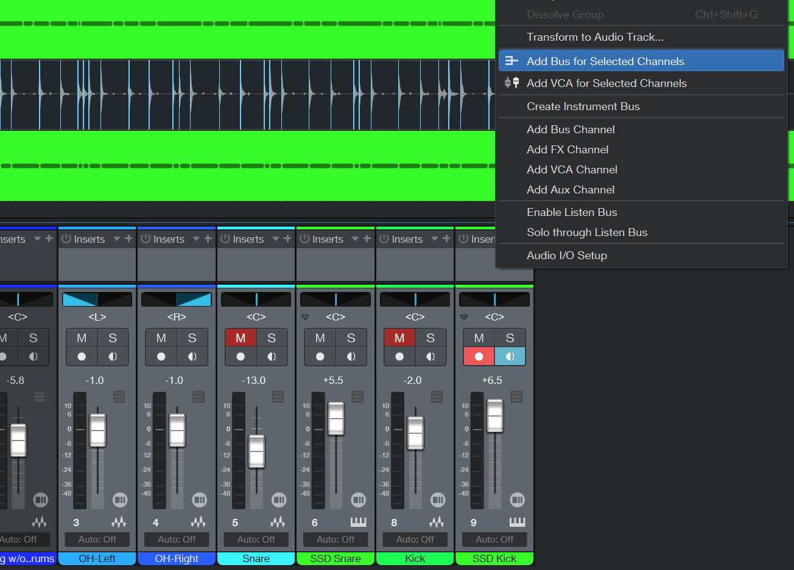

import WebsiteDesignCTA from '../../../../components/common/websiteDesignCTA.tsx';

## Introduction

I've been wanting to write this guide on how I easily mix my drums for a good sounding result at home, so here it is.

This requires a minimal setup that can be quite afordable.

This guide isn't proffesional grade at all, but it's more than enough for posting covers on social media or youtube.

> While this guide is written for Presonus Studio One, it's probably also good for any other DAW or mixing software. We're only going to use a free drum sample plugin and a normal EQ, which most softwares come with.

> NOTE: I discovered too late, that the most important part in this setup are not the microphones, software or plugins, but your drum kit. A **well tuned** drum kit will go **a long way** when it comes to recording and you will be 70% of the way there.

<WebsiteDesignCTA client:visible />

## The setup

### Hardware (mics and stuff)

I wanted to talk about my setup first, since it's what we're going to be recording with.

My recording setup consists of:

- 2 overhead **Rode NT1 Signatures** (300€ new)
- 1 **Shure SM57 LC** on the snare drum (120€ with cable and stand)
- 1 **Sennheiser E 902** on the bass drum (150€ with cable and stand)
- 1 audio interface with at least 4 channels for all of our mics. I'm using an old **Presonus Studio 18/24**

That's it!

With this you can have a great sounding kit.

> You will also see that I have an extra channel to record the bottom of my snare drum on the screenshots, but this is not needed at all and I often lower the volume on it a lot.

### software

This is what I use in this guide:

- **[Presonus Studio One 7](https://eu.presonus.com/products/studio-one-pro)** - But any other DAW will work, you just need to check out how to do the equivalent stuff on it. The steps are pretty simple so I think it shouldn't be a problem.
- **[Steven Slate Drum Sampler 5.5](https://stevenslatedrums.com/ssd5/#SSD5FREE)** - This is an AWESOME drum sampler (pre recorded drum sounds) that's totally free! Install it according to your DAW's instructions.

None of these are sponsored by the way.

## Initial song setup

Here comes the fun part.

With out setup above, I will assume you have 4 tracks recorded like this:

We're gonna make everything sound decent before we proceed with any plugins or stuff.

## De-drum the song (if you are doing a cover)

In this step I like to remove the drums from the song I'm covering.

For this I use **[Moises](https://moises.ai/)**, the free version does a pretty good job at removing the drums using AI.

I basically mute the drum track and export the mix without touching anything else:

I then replace my original song:

## Volume balance

Now we need to adjust the volume of each of our 4 channels. This is what I like to do:

1. Mute the song track
2. Go to a place in the song where you're playing most of the drum kit
3. Set the Left Overhead fader all the way to the Left
4. Set the Right Overhead fader all the way to the Right
5. Start moving the _volume trigger thingy_ on each channel until it sounds quite good

This is the result in my case:

## Sampler time!

You could leave the track as it is and proceed to the next step (EQ and Compressor), but I like adding samples to my drums because it makes them sound SO much better.

What we're going to do here is we're going to replace the kick and the snare drum with proffessionaly recorded drum samples.

We're still going to leave our snare and kick in the background at low volume but our kit will sound great after this.

> For this I use the free SSD Sampler plugin I mentioned above

You want to:

1. Select the snare drum track (just click it)
2. At the top, select the _audio bend_ menu
3. Hit "Analyze":

   

4. Adjust the threshold until you see all of your snare hits with a blue vertical line:

   

5. Add the SSD sampler to your mix:

   

6. Select your kit, for this cover I will select the Hugo kit:

   

7. Create a new instrument track - right click in the track panel - new instrument track:

   

8. Rename it accordingly and select SSD Sampler as the instrument:

   

9. Drag and drop the analyzed track into the instrument track:

   

10. Double click on the track, select the whole midi track (ctrl + A or cmd + A) and move the midi track to the snare track, make sure you drag it vertically so you don't move the notes horizontaly (in my case is the key above _C1_):

    

11. Reduce the volume or mute the original snare recording and adjust the volume of the new instrument track for the mix.

That's it!!

Now you have a sampled snare track that sounds super professional.

Repeat with the bass drum and you're goldedn.

## Create a bus for the drums

In this step we want to basically re-route all the recorded and Instrument drum tracks to a specific output so that we can apply effects to that output, so that it only affects the drum tracks and not other tracks we might have (original song, other instruments, etc.).

This is quite easy to do, just select all the drums channels on the mixer and right click -> Create bus:

## EQ

In the drum bus we just created we click on "add insert" and search for the EQ plugin.

Adjust the EQ to the mix and adjust it like so:

1. Reduce a bit the 400 Hz to reduce those anoying tingling noises
2. Boost a bit the 5.5 kHz to improve those highs from the overheadas
3. Adjust by ear until it sounds good, here's my result for this song:

## Compressor

Just follow the same steps as the EQ and adjust the compressor:

1. Increase the attack and the input gain
2. Adjust threshold and knee

What I recommend here is to just play around with the different knobs to see what each one does, you will get the hang of it really quickly.

Here's my compressor settings for my song:

## Final touches

At this point your drums should be sounding **quite good** already.

Now, if you have a cover track, unmute it and play around with the volume balance between all the tracks until you get a good sounding result.

## Conclusion

As you can see, with just 4 mics and a couple of free plugins, you can have a great sounding drum recording in just a few minutes.
