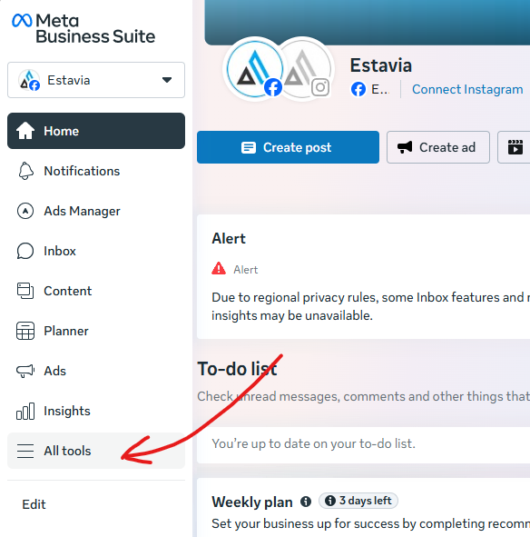
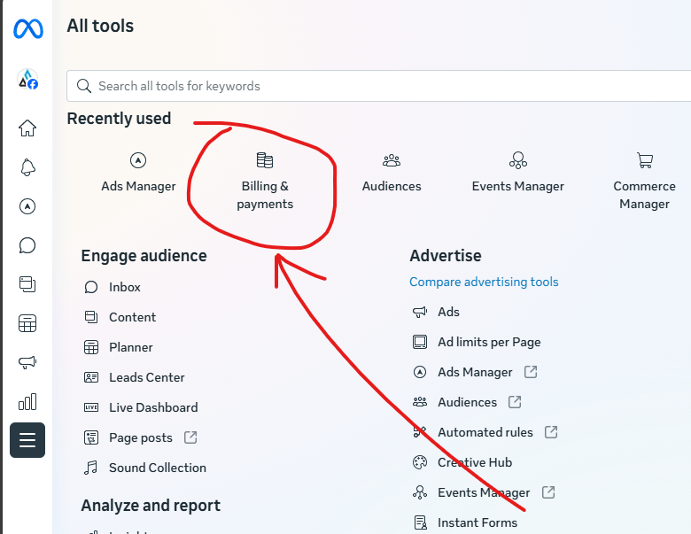
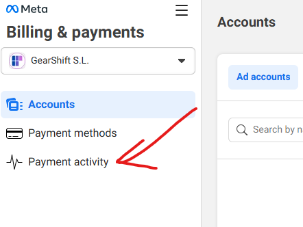
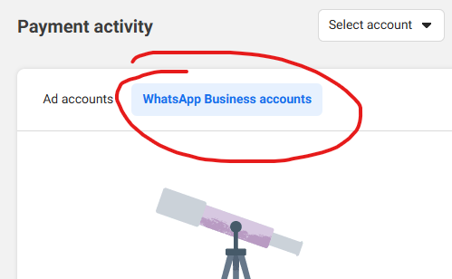
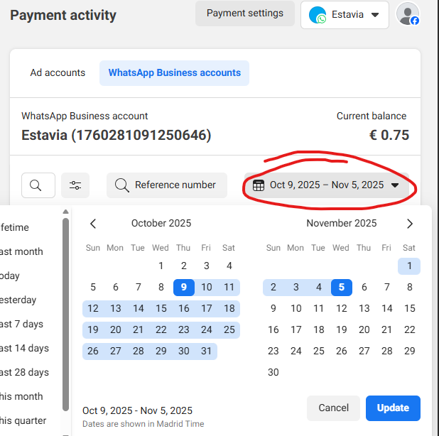
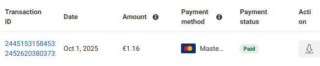
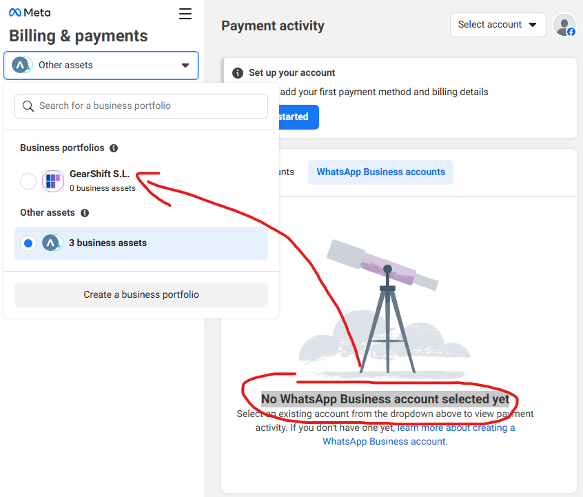
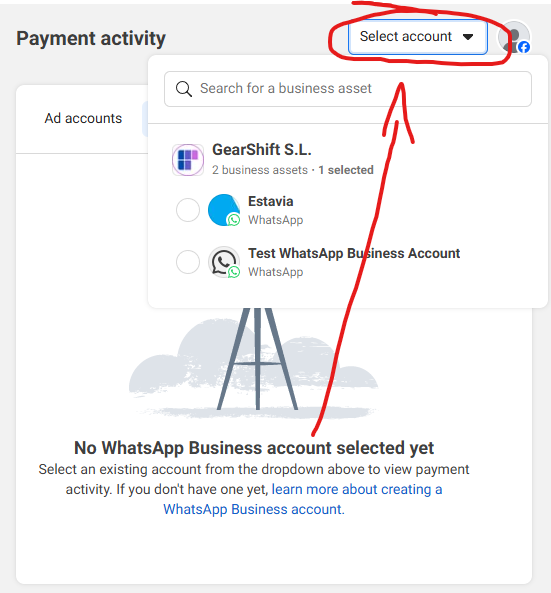

import WebsiteDesignCTA from '../../../../components/common/websiteDesignCTA.tsx';

## Introduction

I use WhatsApp Business to automate messages for some of my apps, but when I went to find the invoices I had to go through a deep rabbit whole to see where they were and how to download them.

In this short guide I will tell you exactly where they are.

<WebsiteDesignCTA client:visible />

## Where do WhatsApp Business Invoices live

You would think that the invoices live inside the WhatsApp Business Manager, but no, Meta always makes things too convoluted for us.

Just follow these steps to find them:

1. Go to your [Meta Business Suite Home](https://business.facebook.com/)
2. On the left panel go to "All tools"
   
3. Click on "Billing & payments"
   
4. On the left panel go to "Payment activity"
   
   > Note that if you don't see the "Accounts" tab on the left you need to [select the correct Portfolio or Asset](#i-dont-see-an-accounts-tab)
5. Select "WhatsApp Business accounts"
   
   > Note, if you get the message , make sure you [select the correct WhatsApp account](#i-dont-see-any-whatsapp-business-accounts)
6. Then just select a date range i.e.: Last month
   

7. You will then see your transaction and a download button for the invoice!
   

---

## Troubleshooting

### I don't see an accounts tab

If you don't see any WhatsApp Business accounts and recieve this message: "No WhatsApp Business account selected yet", make sure to select the correct Asset or Portfolio on the top left:

### I don't see any WhatsApp Business Accounts

If you get the message "No WhatsApp Business account selected yet", make sure to select the correct account on the top right:

<WebsiteDesignCTA client:visible />

## Conclusion

Finding your WhatsApp business invoices is quite convoluted but hopefully this guide helps!
