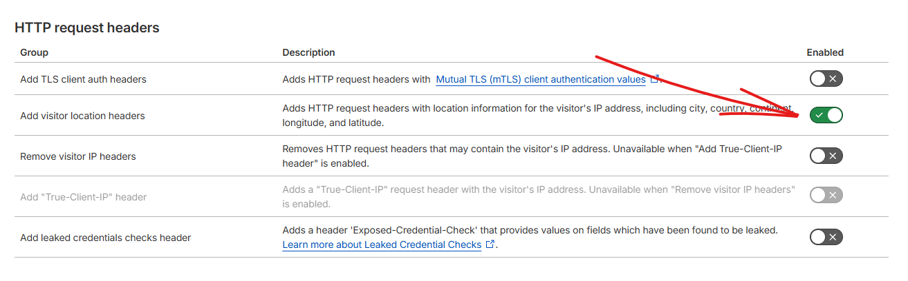

import WebsiteDesignCTA from '../../../../components/common/websiteDesignCTA.tsx';

## Introduction

I've previously talked about [how I love using Umami Analytics]() instead of Google Analytics.

But I came across one issue where my visitors' regions weren't showing up.

<WebsiteDesignCTA client:visible />

## How to fix Umami visitors' regions not populating

The fix is quite easy, 99% of the time is because you're using Cloudflare.

Here's how to fix it:

1. Go to the domain in question in your Cloudflare dashboard

2. Click on "**Rules**" on the left and click on "**Settings**":
   

3. Then, under "HTTP request headers", enable "Add visitor location headers":
   

4. That's it!
   You should start receiving region data from your visitors from now on!
