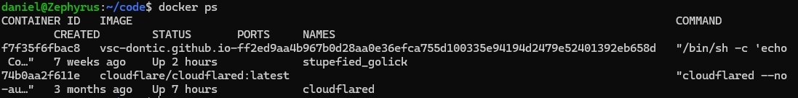
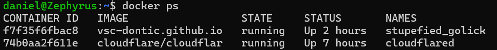

import DockerCourseCTA from '../../../../components/common/dockerCourseCTA.tsx';

## Introduction

Something that has bugged me for a long time is how the command `docker ps` represents in my terminal:



As you can see, the output is split between several lines because it does not fit in my screen, and it makes the output **super hard to read**.

<DockerCourseCTA client:visible />

## The solution

Hopefully, docker implemented a solution that allows us to configure this command as we like.

1. Just open your `config.json`:

   ```bash
   nano .docker/config.json
   ```

   > ℹ️ If you don't have a `config.json` yet, this command will create it.

2. Add the following config to it:

   ```json
   "psFormat": "table {{.ID}}\t{{.Image | printf \"%.20s\"}}\t{{.State}}\t{{.Status}}\t{{.Names}}"
   ```

   So that your config looks like this:

   ```json
   {
    ...whatever you had before...,
     "psFormat": "table {{.ID}}\t{{.Image | printf \"%.20s\"}}\t{{.State}}\t{{.Status}}\t{{.Names}}"
   }
   ```

3. Now your `docker ps` output looks so much better!



## What does this line do and further configuration

Lets analize this code:

```json
"psFormat": "table {{.ID}}\t{{.Image | printf \"%.20s\"}}\t{{.State}}\t{{.Status}}\t{{.Names}}"
```

Here we say:

- `table {{.ID}}` -> Show the ID of the containers
- `{{.Image | printf \"%.20s\"}}` -> Show the image name truncated to 20 characters
- `{{.State}}` -> Show the state of the containers
- `{{.Status}}` -> Show the status of the containers
- `{{.Names}}` -> Show the containers' names

You can customize this however you want, by adding or removing parameters such as:

### Container identification

`{{.ID}}` -> Container ID (short)

`{{.Image}}` -> Image name

`{{.Names}}` -> Container name

### Runtime / state

`{{.Command}}` -> Command used to run the container

`{{.CreatedAt}}` -> Created timestamp (formatted)

`{{.RunningFor}}` -> Time since creation (human readable)

`{{.State}}` -> State (created, running, exited…)

`{{.Status}}` -> Full status (e.g., "Up 5 minutes")

`{{.Ports}}` -> Port mappings

### Resources & metadata

`{{.Size}}` -> Size information

`{{.Mounts}}` -> Mounted volumes

### Labels

`{{.Labels}}` -> All labels

`{{.Label "key"}}` -> A specific label, e.g. `{{.Label "traefik.enable"}}`

### Networks

`{{.Networks}}` -> Networks the container is attached to

---

As you can see, there's a lot of info we can show and format in our own way to make the `docker ps` command much more practical.
