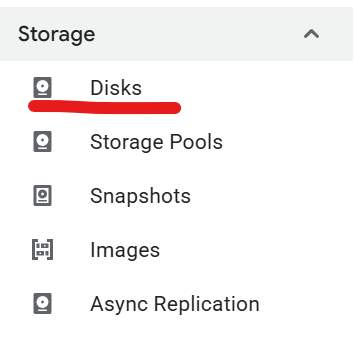
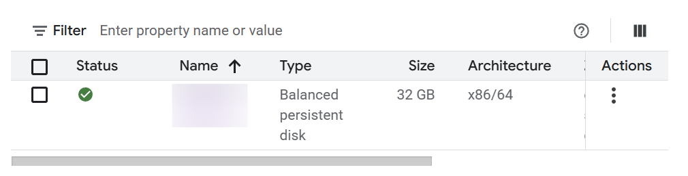
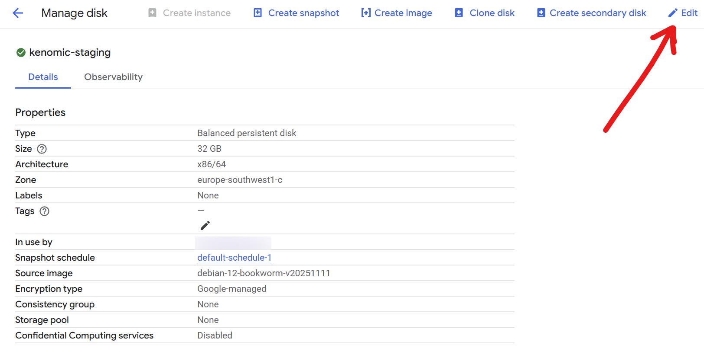
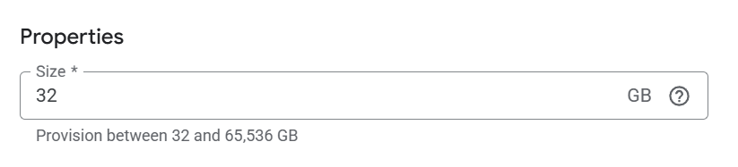

import DockerCourseCTA from '../../../../components/common/dockerCourseCTA.tsx';

## Introduction

I've lately found myself having to increase the disk size on a debian virtual machine in my Google Cloud, more specifically in compute engine.

Here I will show you, step by step, how to do it, it's quite simple.

<DockerCourseCTA client:visible />

## 1. Resize the VM disk

First, we need to resize the disk that is linked to the VM.

This can be easily done from the Web GUI for Compute Engine.

1. In the left panel, go to Disks:



2. Click on the disk that is linked to your VM (usually it has the same name as the VM)



3. Click on "Edit" at the top right



4. In "Size", increase it to the desired size. I will increase it from 10 GB to 32 GB:



> ℹ️ As you can see, you can only increase the size, not decrease it.

5. Hit save at the bottom

## 2. Resize the partition inside the VM

The size of the disk has increased, but our VM partition is still the same, we need to increase it as well.

To do this:

1. SSH into your VM.

2. Verify the current disk state by running `lsblk`, you should see the following:

   ```lua
    sda        32G  <-- disk is now 32 GB
    └─sda1     10G  <-- filesystem still 10GB
   ```

   > ℹ️ If you see any other partitions, that is completely normal.

3. Extend the partition:

   ```bash
   sudo growpart /dev/sda 1
   ```

   With this command, we tell the system to expand the `sda1` partition to occupy as much of the main disk as it can.

   > ℹ️ If you don't have growpart installed you can do so by running:
   >
   > ```bash
   > sudo apt install cloud-guest-utils
   > ```

4. Verify the partition by running `lsblk` again:

   ```lua
   sda        32G
   └─sda1     32G  <-- filesystem is now 32GB
   ```

5. Now we need to expand the debian filesystem. We can do it by resizing it depending on the format:

   If you're on ext4 (most standard Debian systems):

   ```bash
   sudo resize2fs /dev/sda1
   ```

   If you're on xfs:

   ```bash
   sudo xfs_growfs -d /
   ```

6. Done! You should now have the 32 GB (or whatever you wanted) available in your filesystem!
