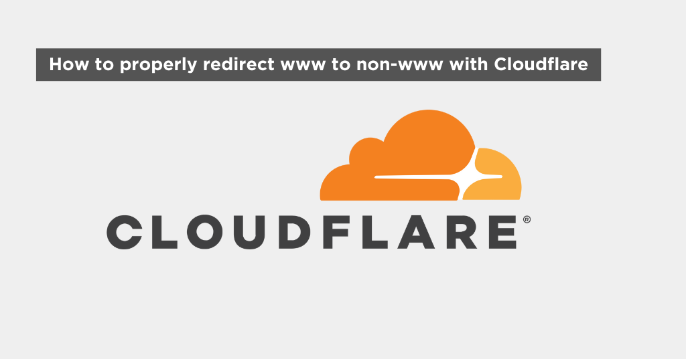

- [Introduction](#introduction)
- [Step by step](#step-by-step)

## Introduction

I've read countless tutorials and watched many YouTube videos until I found the correct way to implement a www redirect in Cloudflare.

When you have a website, you may want to redirect the www version of your domain to the non-www version. This is important for SEO, since search engines prefer a single source, and to avoid duplicate content issues. In this article, we will show you how to properly redirect www to non-www with Cloudflare.

## Step by step

1. Login to Cloudflare
2. Go to the domain you want to set up the redirect
3. Go to "Rules" > "Redirect Rules"
4. Hit "+ Create Rule"
5. Under "Create new Single Redirect" there is a "Redirect from WWW to Root" snippet. Click on "Create a Rule" in that snippet
6. Change the Rule name if you want and hit "Deploy"

That's it! You have successfully redirected www to non-www with Cloudflare.
