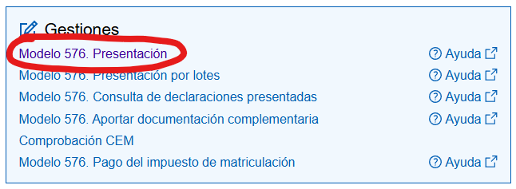
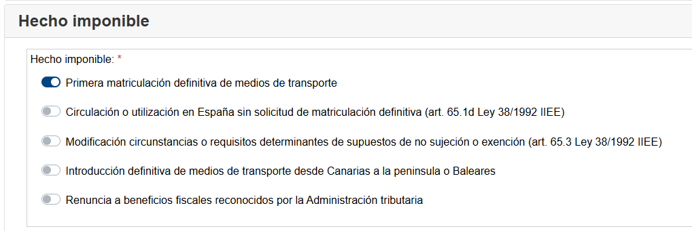
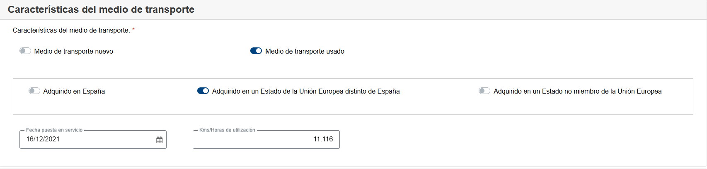
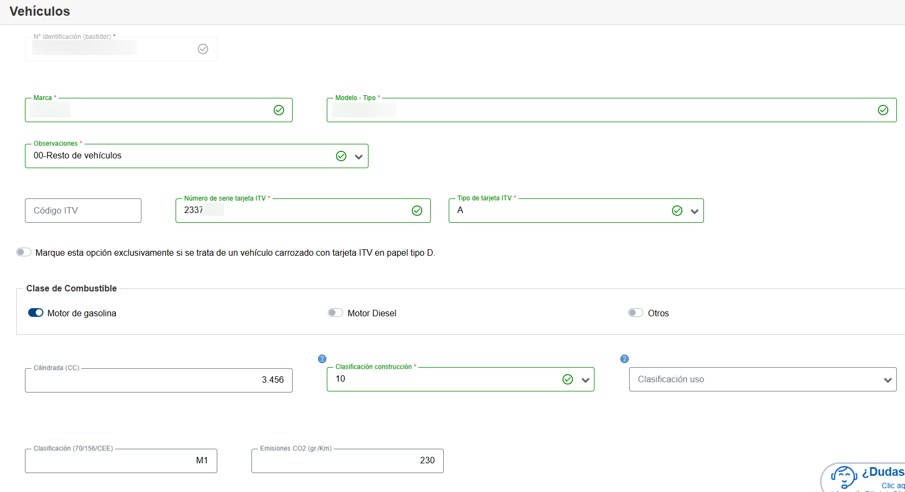
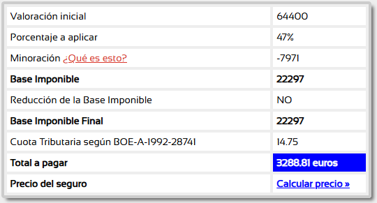
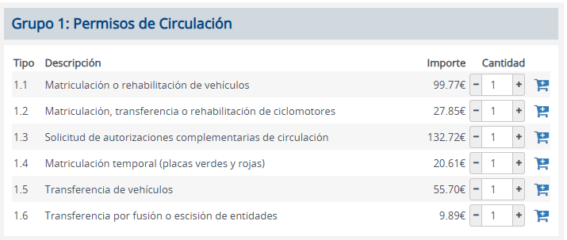

## Introducción

Esta guía la escribo despues de aprender todo sobre cómo importar un coche de Alemania a España sin intermediarios.

A principios de noviembre me compré un coche en Alemania, esta ha sido la aventura:

## 1. Revisar el coche

Dirás "obvio"... pero hay mucha gente que se fia de todo el mundo.

Lo primero que tienes que hacer, si puedes, es ir a ver el coche e inspeccionarlo en persona. Bien eso, o mandar a algún mecánico de confianza a que le eche un ojo.

En este paso recomiendo mirar en los foros de la marca o preguntarle a ChatGPT cuáles son los problemas más comunes del modelo.

Si está todo ok, pagas el coche y coges toda la documentación del vehículo y te la traes de vuelta a España (deja una de las llaves para el transportista).

**Documentos que vas a necesitar**:

- CoC -> Todos los coches modernos lo suelen traer, si no lo tiene, te va a tocar contactar con la marca y pedirles uno (normalmente ~100€).  
  Si la marca ya no existe o no puedes obtenerlo, tendrás que pedir una ficha de homologación en España (en las propias ITVs las suelen hacer).
- Ficha técnica extranjera
- Contrato firmado
- Factura (si lo compras a un profesional)
- Justificante de pago (normalmente una transferencia)

## 2. Contratar el transporte o traer el coche conduciendo

Lo más cómodo suele ser traer el coche en camión, hay varias empresas en España que lo hacen. Si le has comprado el coche a un profesional, ellos suelen tener contactos que hacen este servicio también.

Si lo traes conduciendo, vas a tener que tramitar unas **matrículas temporales del país de origen** y contratar un seguro por días. Yo esto no lo recomiendo puesto que, dependiendo del país, es un lío obtener las matrículas temporales, además de que los seguros por días no suelen cubrir casi nada y, si tienes un accidente con el coche, date por j\*dido.

Una vez sepas la fecha en la que el coche va a llegar a España puedes ir adelantando trámites.

> Es aconsejable pedirles que te dejen el coche directamente en una ITV para ahorrarte la grua desde tu casa.

## 3. Preparar identificación telemática

Tener acreditación telemática **facilita muchísimo todo el proceso**.

Para todos estos trámites recomiendo sacarse el **certifiacdo digital** o **DNI electrónico** si no lo tienes todavía.

## 4. Pedir cita en la ITV con antelación

> ℹ️ **Pre-requisitos**:
>
> - CoC
> - Ficha técnica extranjera
> - Contrato de compraventa

Lo primero que vas a tener que hacer, antes de realizar cualquier otro trámite, es pasar la ITV.

Además, no es una ITV normal, sino una **ITV de importación/homologación**:

1. Llama a tu ITV de confianza y diles que vas a importar un coche.

2. Te darán un email de contacto con su equipo técnico para que les envíes:

   - El CoC
   - La ficha técnica extranjera del coche
   - El contrato de compraventa

3. Puede ser que te contacten si les falta alguna documentación extra.

4. Una vez lo revisen se pondrán en contacto contigo para darte una cita, **intenta que coincida con la llegada del coche**!

## 5. Recepcionar el coche y pasar la ITV

> ℹ️ **Pre-requisitos**:
>
> - Tener el coche
> - Cita con la ITV
> - CoC
> - Ficha técnica extranjera
> - Contrato de compraventa

1. Pagar y pasar la ITV ese día (suelen ser unos 150€ - 250€ dependiendo de la ITV).

2. Obtener ficha técnica Española, te darán:
   - Un ejemplar para tí
   - Un ejemplar para los servicios de insdustria de la provicincia en la que se matricula el vehículo
   - Un ejemplar para la jefatura provincial de tráfico

## 6. Impuesto de transmisiones patrimoniales (ITP - Modelo 620)

> ℹ️ Si el coche es de **segunda mano (>6 meses o >6.000 km) y se lo has comprado a un profesional**, no tienes que pagar ITP, pero necesitarás el justificante de exención.

> **Pre-requisitos**:
>
> - Contrato de compraventa
> - Factura (si aplica)
> - Justificante de pago

Aquí ya empezamos con los impuestos! **Bieeeen**!

El ITP lo tienes que pagar si:

- El **coche es nuevo** (se considera nuevo si tiene **menos de 6 meses o 6.000 kms**)
- Se lo has comprado a un **particular**

Este impuesto se paga en la comunidad autónoma en la que residas.

Si resides en **Madrid**:

1. Accede [aquí](https://gestiona.comunidad.madrid/opti_webapp_contrib/#/autenticacion).

2. Entra con tu DNI o certificado digital.

3. Una vez dentro, selecciona "Vehículos 620"

4. Le damos a "Nueva autoliquidación"

5. Rellenas todo lo que te pida

   > ℹ️ **Nota para calcular el precio del coche:**  
   > Como la gente antes modificaba los contratos para pagar menos ITP, ahora comunidades autónomas como Madrid te calculan el precio y a joderse.  
   > Si estás en Madrid, puedes calcular el valor [aquí](https://gestiona.comunidad.madrid/vlin_valora_bienes/secure/vehiculos/turismos.jsf?id=100_Turismos).

6. En caso de que no nos aplique este impuesto por ser de segunda mano comprado a un profesional, le damos a "No Sujeto" y luego a "SUJETO AL IVA"

7. Pagar si aplica (_tocotó_)

8. Descargar el justificante

## 7. Impuesto de matriculación (IEDMT - Modelo 576)

> **Pre-requisitos**:
>
> - Ficha técnica Española (te la dan al pasar la ITV)
> - Contrato de compraventa
> - Factura (si aplica)
> - Justificante de pago del coche (suele ser una transferencia)
> - Datos del coche (Bastidor, emisiones, etc.)

Este es el impuesto que se paga por matricular el coche en España y es bastante complicado por toda su casuística.

### Cómo funciona

El impuesto de matriculación se calcula en base al **valor de mercado** del coche y de **lo que contamine**.

#### Base imponible y Valor de mercado

La base imponible del impuesto **es el valor del mercado del vehículo**, eso lo tenemos, ¿y cómo narices lo obtengo?

Fácil:

1. Si el modelo de tu coche está en las tablas del BOE, la base imponible será el valor que diga esa tabla. La Comunidad de Madrid tiene una [herramienta para consultar el valor de tu coche en estas tablas](https://gestiona.comunidad.madrid/vlin_valora_bienes/secure/vehiculos/turismos.jsf?id=100_Turismos).

   Además, podrás minorarle el valor de todos los impuestos que hubiese tenido que pagar el coche durante su vida hasta ahora si se hubiese matriculado en España cuando era nuevo.

2. Si tu modelo no está en tablas estas j\*odido. Tienes 2 opciones:  
   a) Buscar un modelo similar en tablas y rezar para que no te pongan pegas  
   b) No te queda otra que poner como base imponible el **precio que ponga en el contrato (o factura) sin minoraciones**.

#### Epígrafes de emisiones

Estos son los epígrades actuales que dictan que % tienes que pagar según las emisiones del coche:

- Epígrafe 1 -> Hasta 120 g/km de CO2: 0%
- Epígrafe 2 -> Entre 121 y 159 g/km de CO2: 4,75%
- Epígrafe 3 -> Entre 160 y 199 g/km de CO2: 9,75%
- Epígrafe 4 -> Por encima de 200 g/km de CO2: 14,75%

> Recomiendo usar [esta herramienta intuitiva](https://www.dieselogasolina.com/calcular-impuesto-matriculacion-coche-moto-hacienda.html) para calcular lo que te va a costar este impuesto.

### Pasos a seguir

Se paga directamente en la agencia tributaria en toda España:

1.  Accede [aquí](https://sede.agenciatributaria.gob.es/Sede/procedimientoini/G502.shtml).

2.  Selecciona "Modelo 576. Presentación". Te pedirá tu certificado digital.

    

3.  Te aparecerá un dialogó donde tendrás que seleccionar Automóviles e introducir el número de bastidor. Luego le damos a "Aceptar"

    

4.  La siguiente página es el formulario, donde rellenamos:

    a. **Identificación** -> Rellena tu NIF y tu nombre completo

    b. **Hecho Imponible** -> Seleccionamos "Primera matriculación definitiva de medios de transporte"

    

    c. En **Características del medio de transporte** seleccionamos lo que corresponda, en mi caso selecciono:

    - "Medio de transporte usado"
    - "Adquirido en un Estado de la Unión Europea distinto de España"
    - Fecha de puesta en servicio -> Fecha de primera matriculación (definitiva o provisional) dentro del a Unión Europea.
    - Kilómetros del coche

    

    d. **Vehículos**:

    - La marca y el modelo -> En el modelo recomiendo poner el que más se acerque en tablas
    - Observaciones -> `00 - Resto de vehículos` (Mira el resto de opciones por si aplican a tu caso)
    - Código ITV -> Dejar vacío
    - Número de serie tarjeta ITV -> Viene en **rojo** en la parte de arriba de la ficha técnica de la ITV
    - Tipo de tarjeta ITV -> Es una letra grande que viene al lado del número de serie
    - Marcamos el tipo de combustible
    - Cilindrada -> Apartado P.1 de la ficha técnica
    - Clasificación construcción -> Apartado C.L de la ficha técnica
    - Clasificación uso -> Dejar vacío
    - Clasificación 70/156/CEE -> Apartado J de la ficha técnica
    - Emisiones CO2 -> Apartado V.7 de la ficha técnica

    

    e. **"Identificación de la persona o entidad que ha introducido en España el vehículo (sólo tarjetas ITV tipo "A")"**:

    - Aquí simplemente introducimos el CIF y la razón social de la empresa de transporte que nos haya traido el coche.
    - Si lo hemos traido nosotros, será nuestro DNI y nuestro nombre.

    f. **Liquidación** (aquí viene lo interesante):

    - **Base imponible** -> Nos vamos a [este enlace](https://www.dieselogasolina.com/calcular-impuesto-matriculacion-coche-moto-hacienda.html), rellenamos los datos del coche y copiamos la base imponible final.

    

    - **Tipo** -> Seleccionamos el número de epígrafe que aplique a nuestro coche (los tienes más arriba) e indtroducimos el % que corresponda a ese epígrafe. En mi caso es el Epígrafe 4 -> Más de 200 g/km de CO2.

    - Le damos a vlaidar declaración

    - Si está todo correcto, le damos a Formalizar Ingreso / Devolución

5.  Paga (_tocotó_)

6.  Descarga tanto el justificante de pago como la presentación de la declaración

## 8. Impuesto de circulación (IVTM)

> **Pre-requisitos**:
>
> - Ficha técnica Española
> - Datos del coche (Bastidor)

Mas impuestos! Vamoooos!

Este lo tienes que pagar en el ayuntamiento.

> **👁️ OJO!! 👁️**
>
> Hay algunos ayuntamientos que de manera telemática solo te permiten pagar por matrícula (cosa que obviamente todavía no tienes).
>
> En estos casos tendrás que ir presencialmente con la documentación del coche y gestionarlo allí.

En mi caso, mi ayuntamiento me dejó hacerlo telemáticamente aportando el bastidor y la documentación del coche online.

## 9. Tasas de circulación

> **Pre-requisitos**:
>
> - Nada

No te has cansado de impuestos todavía? Pues **seguimos**!

Estas tasas son las que cobra tráfico por el trabajo tan enorme que supone registrar tu vehículo.

No tienes que introducir ningún dato, por así decirlo es como si comprases "un vale por 1 matriculación":

1. Accede [aquí](https://sedeclave.dgt.gob.es/WEB_Tasas7/).

2. Selecciona "Pagar Tasas"

3. Accede con DNI o certificado electrónico

4. Abre el Grupo 1: Permisos de Circulación

   

5. Añade al carrito la tasa "1.1 Matriculación o rehabilitación de vehículos - 99.77eur"

6. Paga (_tocotó_)

7. Descarga el justificante de pago y las el documento de las tasas

## 10 Proceso de matriculación en tráfico

> **Pre-requisitos**:
>
> - Modelo 01 - Solicitud de trámite de vehículos
> - Certificado de empadronamiento
> - Documentación del país de origen del coche:
>   - Ficha técnica extranjera
>   - Permiso de circulación extranjero
>   - COC
> - x La ficha técnica Española (ITV)
> - Pago o exención del ITP (ITP - 620)
> - x Impuesto de matriculación (IEDMT - 576)
> - x Impuesto de circulación (IVTM)
> - x Tasas 1.1 de circulación
> - El contrato de compraventa
> - Factura (si aplica)

Y despues de desembolsar todo lo de arriba, por fin podemos matricular nuestro coche! (Que también hay que pagar!)

Este trámite se puede realizar online en tráfico:

1. Descarga, cumplimenta y firma el[ Modelo 01 - Trámites de Vehículos de la DGT](https://sede.dgt.gob.es/export/sites/dgt/.galleries/modelos-solicitud/01/Mod.01-ES.pdf).

2. Solicita, si no lo tienes, tu certificado de empadronamiento (lo puedes obtener telemáticamente en la mayoría de ayuntamientos). Este es necesario para probar que has pagado el IVTM donde toca.

3. Accede [a la sede electrónica de la DGT para la matriculación de vehículos provenientes del extranjero](https://sede.dgt.gob.es/es/vehiculos/matriculaciones-de-vehiculos/matriculacion-ordinaria/).

4. Le damos a "Registro electrónico"

5. Lugar de compra del vehículo -> Es un vehículo proveniente del extranjero (nuevo o usado)

6. Qué clase de vehículo quieres matricular -> Cualquier otro tipo vehículo (coche, moto, autobús, camión, … )

7. Le damos a "Realizar la matriculación" y nos metemos con nuestro certificado digital.

8. Rellenamos nuestros datos personales

9. Nos vamos a la sección solicitud:

   - Matrícula del vehículo -> Lo dejamos en blanco
   - Bastidor del vehículo -> Lo metemos
   - Materia de tramitación -> Matriculación
   - Información del trámite a solicitar -> Metemos el siguiente texto:
     ```
      Solicito la matriculación en España de un vehículo usado procedente de otro Estado miembro de la UE, a nombre de persona física, en la Comunidad de Madrid.
      Se adjunta la documentación necesaria, habiéndose realizado previamente el pago del modelo 576, IVTM, tasas DGT y aportada la documentación de origen y ficha técnica.
      Bastidor (VIN): [Tu basticor].
      Solicito la asignación de matrícula española y la expedición del permiso de circulación.
     ```

10. En "Documentos a adjuntar" metemos:

    - El ITP (si corresponde)
    - El Modelo 576
    - El IVTM
    - Las tasas de la DGT
    - La ficha técnica española
    - El contrato de compraventa
    - La factura de compra (si corresponde)

11. Le damos a "Enviar"

12. Descarga el justificante.

Si no te ponen ninguna pega o no falta documentación, en unos días recibirás el permiso de circulación.

## 11. Solicitar matrículas verdes (opcional)

> **Pre-requisitos**:
>
> - Justificante del pago del Impuesto de matriculación (IEDMT - 576)
> - Justificante de solicitud de matriculación definitiva
> - Justificante del pago de las Tasas 1.1 (matriculación)
> - Justificante del pago de las Tasas 1.4 (ploacas verdes)
> - Justificante del pago del Impuesto de circulación (IVTM)
> - El contrato de compraventa

Las placas verdes te dejan circular con tu coche _en proceso de matriculación_ hasta 60 días.

Yo las cogí porque estaba que no cagaba con poder usarlo.

Se puede tramitar online:

1. Paga las tasas 1.4 siguiendo [el mismo proceso que el de las tasas 1.1](#9-tasas-de-circulación)

2. Accede [aquí](https://sede.dgt.gob.es/es/vehiculos/matriculaciones-de-vehiculos/matricula-temporal-placas-verdes/).

3. Pincha en "Registro electrónico"

4. Selecciona "Vehículo pendiente de tramitar su matriculación definitiva"

5. Adjunta toda la documentación.

6. Una vez aprobada, ve a un sitio de matrículas y pide tus placas verdes. Con ellas podrás contratar un seguro y circular sin problema!

## 12. Placas definitivas

Una vez te manden tu permiso de circulación, podrás ir a un sitio donde hagan matrículas y pedir las matriculas definitivas.

## 13. Contrata el seguro definitivo

Llama a tu aseguradora y contrata el seguro para el vehículo.

## Conclusión

Importar un coche de la UE es un trámite bastante burocrático, con muchos impuestos, pero relativamente sencillo.
