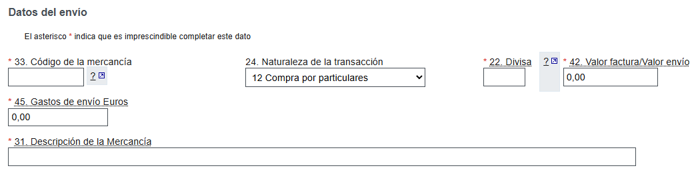
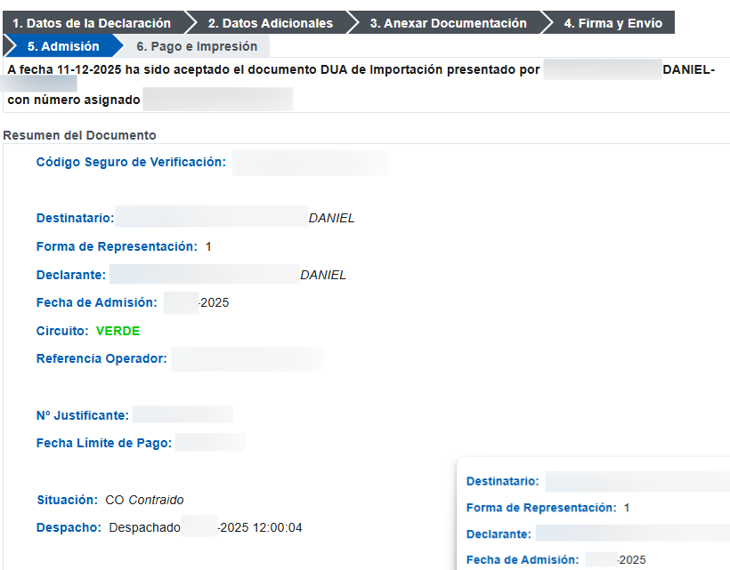
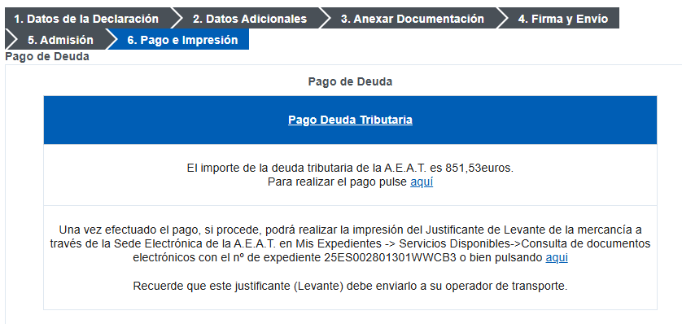
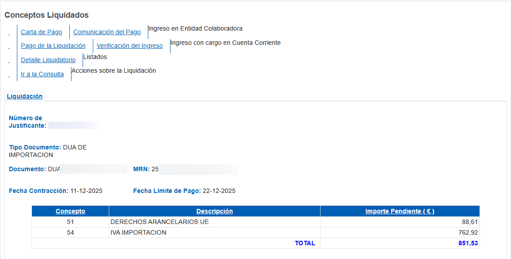
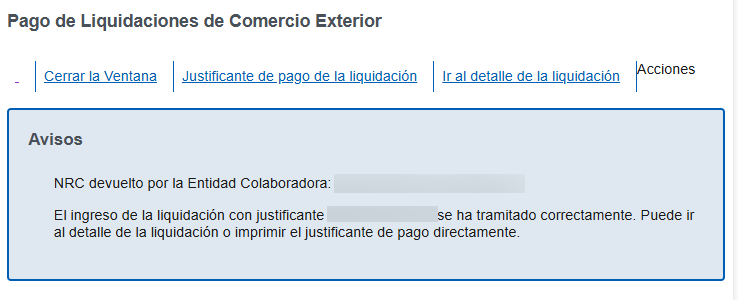
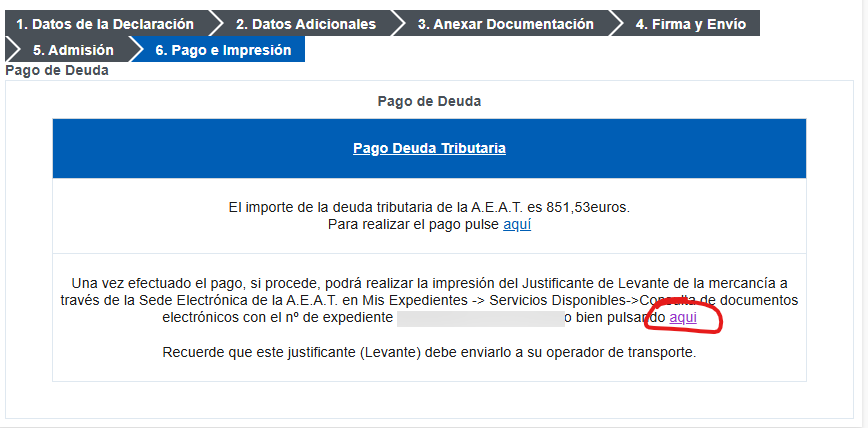
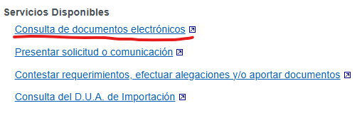
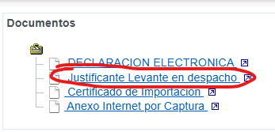

## Introducción

Si alguna vez te ha llegado un paquete de fuera de la UE, sabes muy bien que antes de entregártelo, la compañía de turno (DHL, Fedex, Correos...) te manda un mensaje diciendo que tienes que pagar aduanas para poder liberar el paquete.

Lo que quizá no sepas es que estas empresas te meten un gasto de gestión considerable por hacer un trámite que puedes hacer tú en 5 minutos.

Para ello **te tienes que adelantar a la empresa**, en cuanto sepas el número de envío, procede a hacer este trámite y enviárselo a la empresa de mensajería correspondiente **cuanto antes**.

## 1. Comunicarle a la empresa de mensajería que lo vas a tramitar tú

Una vez tengamos el número de envío, nos dirigimos a la empresa de mensajería que nos haya tocado y les mandaremos el siguiente mensaje a su dirección de contacto:

> Buenos días,
>
> Me pongo en contacto con ustedes en relación con el envío internacional [Número de seguimiento del envío] a mi nombre que está pendiente de llegar a España.
>
> Por la presente, solicito expresamente que [Empresa de transporte] no lleve a cabo el despacho de aduanas de dicho envío, ya que realizaré personalmente los trámites aduaneros ante la Agencia Tributaria.
>
> Les agradecería que no inicien ningún procedimiento de despacho.
>
> Muchas gracias por su atención.
>
> Atentamente,
> [Tu nombre completo]

Te deberán responder con los documentos necesarios para el autodespacho.

## 2. Preparar la documentación

Vas a necesitar la siguiente información del envío:

- Nuestro certificado digital o Cl@ve - Para poder acceder a todas las gestiones de la Agencia Tributaria
- Número de envío
- Factura de compra
- Datos de la empresa donde lo compraste (Razón social y dirección)

## 3. Esperar a que el envío se encuentre en España

Si el envío no ha llegado a España, ni Aduanas ni la Agencia Tributaria lo tendrán registrado todavía y, por tanto, no podremos hacer ninguna gestión al respecto.

## 4. Hacer el auto despacho de aduanas

Este trámite lo realizamos nosotros directamente con hacienda:

### 4.0. Iniciar el formulario

1. Vamos a [Agencia Tributaria - Aduanas](https://sede.agenciatributaria.gob.es/Sede/aduanas_.html)

2. Hacemos click en [Comercio electrónico. PIPE. Envíos entre particulares](https://sede.agenciatributaria.gob.es/Sede/aduanas/comercio-electronico-pipe-envios-particulares.html)

3. Dependiendo del valor de nuestro envío, haremos click en:

   - Menos de 150€ -> Formulario de presentación de importación de escaso valor H7
   - Más de 150€ -> Formulario de importación de mercancías de +150 euros para particulares

   > La diferencia está en que en envios de menos de 150€ hacienda no cobra aranceles.

### 4.1. Datos de la Declaración.

Pasamos a rellenar los datos de la declaración:

1. Destinatario -> Aquí rellenamos nuestros datos

2. Expedidor -> Estos son los datos de la empresa a la que compraste la mercancía. Si te falta alguno puedes enviarles un email pidiéndoselos.

3. Referencia del envío -> Este suele ser el número de envío o waybill.

   > En el caso de **DHL**, suele ser el número de envío con un 0 por delante.  
   > Ejemplo: 6335077835 -> 06335077825

4. Datos del envío

   

   Este apartado es un poco más complicado.

   - **Código de la mercancía** -> Existen muchísimos códigos para todo tipo de mercancias, pero nosotros usaremos el código `9990000300`, que es el que se ha de usar para "Declaraciones de importación realizadas por particulares" y nos quitamos de problemas.

   - **Naturaleza de la transacción** -> Aquí dejamos `12 Compra por particulares`

   - **Divisa** -> Escogemos la divisa original de la compra

   - **Valor factura** -> Introducimos el valor de los artículos en la divisa original, sin contar con los gastos de envío.

   - **Gastos de envío en Euros** -> Si los gastos de envío en nuestra factura no están en euros, tendremos que hacer la conversión.

   - **Descripción de la Mercancía** -> Describimos con pocas palabras cuál es el contenido.

5. Aceptamos las condiciones y le damos a siguiente.

### 4.2. Datos Adicionales

Aquí nos saldrá un resumen de todo. Comprobamos que está todo bien.

Rellenamos el número de factura en el caso de que nos lo pida.

Le damos a siguiente.

### 4.3. Anexar Documentación

Aquí deberemos de anexar la factura.

Le damos a siguiente.

### 4.4. Firma y Envío

Aquí simplemente le damos a firmar y enviar.

### 4.5. Admisión

Una vez firmado, nos deberá salir que el paquete está en el circuito VERDE.

De ser así, todo perfecto, podemos darle a siguiente.

> ℹ️ Si sale circuito naranja o rojo, significa que hacienda tiene que revisar algo. Deberemos de revisar la documentación para ver que no se nos haya pasado nada.

### 4.6. Pago e Impresión

En el siguiente paso, se nos dará un enlace para pagar:

Una vez se nos abra la carta de pago, hacemos click en "Pago de la liquidación":

Podremos pagar con cuenta o con tarjeta. Una vez lo realizemos, podemos darle a descargar justificante:

## Obtener el Justificante de Levante

Ahora nos deberemos de ir a consulta de documentos.

En la ventana anterior, hacienda nos da un enlace para ir directamente:

Le damos a Consulta de Documentos:

Le damos a Justificante Levante en despacho:

Nos descargamos el pdf.

## Enviar el justificante de levante a la empresa de transporte

Ahora solo queda enviar el Justificante de Levante a la empresa de transporte y ya estaría todo!

Procederán a despachar nuestro paquete en aduanas y a entregárnoslo.
