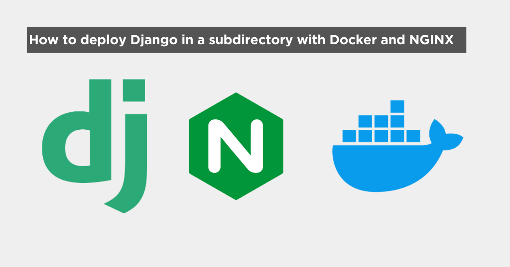

# How to deploy Django in a subdirectory with Docker, NGINX and Whitenoise

- [Introduction](#introduction)
- [My setup](#my-setup)
- [The problem](#the-problem)
- [The solution](#the-solution)
  - [1. Configure django](#1-configure-django)
  - [2. Configure Static Files](#2-configure-static-files)
  - [3. Admin login](#3-admin-login)
  - [4. Configure Nginx](#4-configure-nginx)
- [Conclusion](#conclusion)

## Introduction

If you are here, you've probably faced the same challenged as I did and spent countless hours on google trying to find how to make a django application work in a subdirectory.

Look no further, here's all you need to know to make it work.

## My setup

I want my frontend to be served in the root `/` of my domain and the backend to be served in the `/api` subdirectory of the same domain:

```
https://example.com/ -> Frontend
https://example.com/api/ -> Backend
```

I'm going to quickly run you through my setup so you can understand the context of this article.

- I have a monorepo with two folders: `backend` and `frontend`
- `backend`: django REST API that serves data and an admin page
- `frontend`: React frontend that consumes the API
- Docker to containerize the application
- Nginx to serve the Frontend application **and** serve the django API in a subdirectory

```
project/
├── backend/
│   ├── Dockerfile
│   └── other django stuff...
├── frontend/
│   ├── Dockerfile
│   ├── default-nginx.conf
│   └── other frontend stuff...
└── docker-compose.yml
```

This is my sample docker compose file:

```yaml
services:
  backend:
    build:
      context: ./backend
      dockerfile: Dockerfile
    ports:
      - '8000:8000'

  frontend:
    build:
      context: ./frontend
      dockerfile: Dockerfile
    ports:
      - '8080:80'
    depends_on:
      - backend
```

## The problem

When I tried to deploy the application to a subdirectory, I faced a few challenges:

1. The API was not working
2. The static files were not being served
3. The admin page was not working

## The solution

### 1. Configure django

First, we need to configure Django to let it know that we are running in a subdirectory.

Add the following to your `settings.py`:

```python
FORCE_SCRIPT_NAME = '/api'
```

> Important!
>
> Having the leading slash is important to make the static files settings below work correctly.

`FORCE_SCRIPT_NAME` is a setting that tells Django to prepend the given value to all URLs generated by Django.

You can find more documentation [here](https://docs.djangoproject.com/en/5.1/ref/settings/#force-script-name).

### 2. Configure Static Files

We need to configure Django to serve the static files correctly in the subdirectory, otherwise, they won't be found.

You're probably familiar with the following settings in `settings.py`:

```python
STATIC_ROOT = BASE_DIR / "staticfiles"
STATIC_URL = "/static"
```

You need to modify it to include the subdirectory:

```python
STATIC_ROOT = BASE_DIR / "staticfiles"
STATIC_URL = "{}/static/".format(FORCE_SCRIPT_NAME)
```

If you are using **Whitenoise** you will also need to include the following setting:

```python
WHITENOISE_STATIC_PREFIX = "/static/"
```

> There is a PR that has been merged that allows you to not have to set this setting, but it's not released as of the time of writing this article.
>
> You can find the PR [here](https://github.com/Archmonger/ServeStatic/pull/21).

### 3. Admin login

The settings above should make the admin page work, but some people have reported encountering the admin page redirecting them to the root of the domain after login.

There's a setting that allows you to override the default admin login redirect:

```python
LOGIN_REDIRECT_URL = '/api/admin/'
```

> You can find more information about this setting [here](https://docs.djangoproject.com/en/5.1/ref/settings/#login-redirect-url).

### 4. Configure Nginx

Here comes to most tricky part in my search, it took me a while to figure out how to configure Nginx to serve the backend in a subdirectory.

I will explain the configuration in detail, but here's the final configuration:

```nginx
server {
    listen 80;
    server_name localhost;

    root /usr/share/nginx/html;
    index index.html;

    # React frontend
    location / {
        try_files $uri $uri/ /index.html;
    }

    # Django API
    location /api/ {
        proxy_pass http://backend:8000/;
        proxy_set_header Host $host;
        proxy_set_header X-Real-IP $remote_addr;
        proxy_set_header X-Forwarded-For $proxy_add_x_forwarded_for;
        proxy_set_header X-Forwarded-Proto $scheme;
    }
}
```

> I will assume you have basic knowledge of how nginx works so I will ignore the basic configuration and go straight to the relevant parts.
>
> For context, I have built my frontend to `/usr/share/nginx/html` previously. Nginx is serving those files in the root of the domain.

Let's break it down:

- `location /api/`: This is the location block that will serve the Django API in the subdirectory `/api/`.
  **IMPORTANT**! Note that it has both a trailing and leading slash. This is important to make django work correctly in a subdirectory.
- `proxy_pass http://backend:8000/`: This is the most important part. It tells Nginx to proxy all requests to `/api/` to the backend service running with Docker on port 8000. Cool thing about docker is that we can reference the service by its name, in this case `backend`.

Now to the headers:

- `Host $host`: This sets the Host header to the value of the host header of the request. It basically passes the host header from the client to the backend.
- `X-Real-IP $remote_addr`: This sets the X-Real-IP header to the value of the remote address of the client. This is useful for the backend to know the real IP of who is making the request.
- `X-Forwarded-For $proxy_add_x_forwarded_for`: This header maintains a chain of IP addresses a request has traversed. It's similar to X-Real-IP but provides more comprehensive information.
- `X-Forwarded-Proto $scheme`: This header informs the backend about the protocol (HTTP or HTTPS) used by the client to connect to Nginx. Without this, your Django application wouldn't know if the original request was secure (HTTPS) or not.

## Conclusion

That's it! You should now have your Django application running in a subdirectory with Docker and Whitenoise.

I really hope this article saves you some time and headaches!
