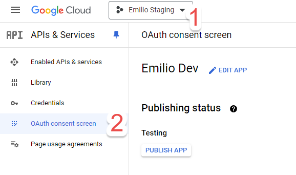
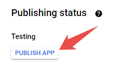
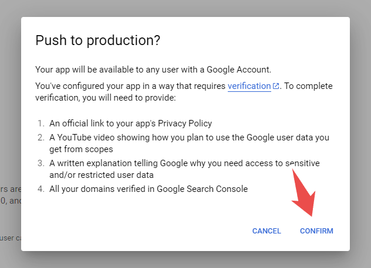

## Table of contents

## Introduction

This article is part 2 of a 4 part series on [how to publish your Google Cloud Project App](/blog/publishing-your-google-cloud-project-app/)

> Previous article: [Introduction](/blog/publishing-your-google-cloud-project-app/)

This is the very first step you need to do in order to publish your Google Cloud Project App.

## Prerequisites

These are the mandatory things you need to have in place in order to start the process:

1. You should have a working Web App or API that uses your Google Project.

   > **Note**:
   >
   > Because the certification process is quite long, if you're just begining to develop your app, I recommend you to start the process as soon as possible with a super simple use case.
   >
   > In our case, we wanted to use the Gmail API, so we just had a simple webhook endpoint that received the data from the API and printed it to the console.

2. You must have a landing page or a frontend with a publicly accessible **Privacy Policy**.

3. You need to create and post a video of a screen recording explaining how your app uses Google data to **Youtube**. Make it unlisted so it can only be accessed by the link you provide.

4. A written summary explaining how you plan to use any sensitive or restricted data.

   To check which data is sensitive go to your OAuth page scopes:

   a. Go to the OAuth screen tab in the Google project.

   b. Hit edit.

   c. The second screen will tell you which ones are sensitive or restricted data.

5. All the domains you use for your tool have to be verified in the Google Search Console.

I know it seems like a lot, but just take it step by step and you’ll eventually have everything you need in no time.

## The publishing process

1. Go to [https://console\.cloud\.google\.com/apis/credentials/consent](https://console.cloud.google.com/apis/credentials/consent), which should take you to your project’s OAuth page. If you have multiple projects, make sure you’re in the right one by clicking it at the top.

2. Hit **Publish App** under the Testing section

3. Confirm the push to production

4. Google will take you to a page where you need to fill in all the details they asked in the confirmation window (which you should have ready with the prerequisites in this article).

5. Once you send them everything, you just now need to wait for them to reply.

---

Now you can head on to the next step of the process:

[Resolve Google's queries](/blog/publishing-your-google-cloud-project-app-resolve-google-queries/)
