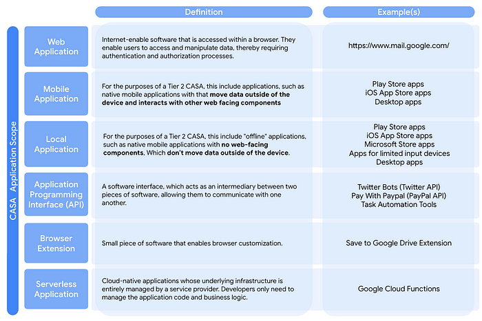
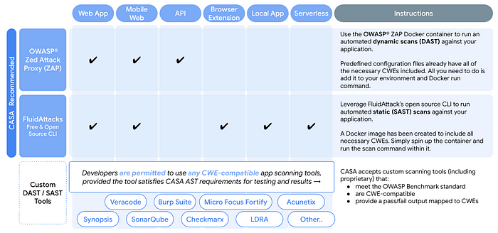

## Table of contents

## Introduction

This article is part 4 of a 4 part series on [how to publish your Google Cloud Project App](/blog/publishing-your-google-cloud-project-app/)

> Previous article: [Resolve Google's queries](/blog/publishing-your-google-cloud-project-app-resolve-google-queries/)

Congratulations!!

Google has approved the initial process, and now you need to certify your app with the CASA Tier 2 certification.

This process can take from 3 to 6 weeks depending on your app complexity and how fast PWC (the agency in charge of providing the CASA certification) replies.

**Disclaimer**: Because this process involves a bit of code, I will be demonstrating how I did it for [Emilio](https://getemil.io), which uses django (DRF) and react.

## Step overview

**There are 4 steps for the verification:**

1. Selecting a scan tool
2. Scanning your app
3. Submitting the form
4. Feedback and resolving issues

## Step 1: Identify which tool you need to use

### What are these tools?

These are scanning tools that will try to hack their way into security loop wholes in your app, to essentially check if it can be hacked. Essentially, they're just hacking tools really that expose security flaws in your application.

That's why it's really important you use these tools on an isolated environment.

**DO NOT USE THEM ON PRODUCTION!**

### App type selection

There are tons of app types out there, select the app type that most closely resembles yours:



In our case it was an API.

You have yours? Good!

### Tool selection

Now check which one of the two approved scanning procedures(which are easier to use) can be applied to your app type:



Because our app is just an API, I used the OWASP ZAP scan tool.

> If your app allows for both, I recommend using OWASP as it's just a matter of running a docker container on your computer\.

## Step 2: Scan your application

> ⚠️ ‼️ **DO NOT USE THESE TOOLS ON YOUR PRODUCTION DEPLOYMENT** ‼️

Here I will explain how I did it for our API with the OWASP ZAP tool.

If you need a more detailed explanation just go here: [https://appdefensealliance\.dev/casa/tier\-2/ast\-guide/dynamic\-scan](https://appdefensealliance.dev/casa/tier-2/ast-guide/dynamic-scan)

### 2.1. Set up config and context files

For us, having only an API without authentication was quite a blessing, the configuration file for OWASP is already done for you and can be downloaded [here](https://appdefensealliance.dev/casa/tier-2/ast-guide/dynamic-scan).

If you have a full fledged web app, with frontend and backend, you will need to create your own config file and set up authentication, it's a bit more complicated but all the details are explained [here](https://appdefensealliance.dev/casa/tier-2/ast-guide/dynamic-scan).

### 2.2. Deploy a test app

You can't just scan your local environment but it will give a bunch of errors. For instance, you probably won't have HTTPS configured locally.

That's why it's better to deploy your app in a test domain: **owasptestapi.domain.com** and set up everything as you would in production.

### 2.3. Set up Docker

I will be using Ubuntu for this task.

You will need Docker installed, for instructions on how to do it on Ubuntu go [here](https://docs.docker.com/engine/install/ubuntu/).

### 2.4. Scan your app

#### If you have an API like us:

```bash
docker run -p 8080:8080 -v $(pwd):/zap/wrk/:rw
-t owasp/zap2docker-stable zap-api-scan.py
-t https://owasptestapi.domain.com -f openapi -P 8080
-c zap-casa-api-config.conf
-x results-full.xml
```

**Where:**

- `-t https://owasptestapi.domain.com` is the target URL to your test environment for this task.
- `-P 8080` is the port to your app
- `zap-casa-api-config.conf` is the conf file downloaded from the CASA website

#### If you have a full web app:

```bash
docker run -p 8080:8080 -v $(pwd):/zap/wrk/:rw -t owasp/zap2docker-stable zap-full-scan.py
-t https://example.com -P 8080
-c zap-casa-config.conf
-x results-full.xml -n example.context -U username
```

**Where:**

- `https://example.com/` is your web app homepage
- `zap-casa-config.conf` is the configuration you created
- `example.context` is the context file you set up
- `username` is the username in case you have a login

### 2.5. Inspect the outputs

In the console, you should see if everything passed, if not, you will need to start debugging.

You will now also have a file called `results-full.xml`, this file contains even more info on what happened during the attack.

Get the ID of the stuff that didn't pass, then open the XML with your favorite text editor and search for those ID's to get more info.

> I seriously recommend pasting the XML output of the failed cases to ChatGPT to get more context. It helped me quite a bit.

I had a couple of failures but it was just a matter of setting a specific header and enabling HSTS in our Cloudflare certificates.

Repeat this until everything passes, once it does, you're ready for the next step!

## Step 3: Submitting the form

Now head on to the survey (you should have a link to it in the email Google sent you).

Upload the XML file and answer to all the questions.

Beware that there are many people complaining, specially on Reddit, that this process is a pain in the 🍑. The guys revising everything seem to be consulting interns at PWC and are not tech savvy.

### Tips

- On the stuff that you did not answer "Yes" to, to explain it as if you were trying to explain it to a 10 year old.

  Otherwise they will keep asking for clarification.

- Be as transparent as possible.

- There are people out there saying to just reply "Yes" to everything to get it over with, since they don't seem to ask questions about the stuff you replied yes to, but I don't recommend it, so please use it at your own discretion.

## Step 4: Resolving issues

After submitting the survey, they should come back some days after the fact asking you for clarification on some answers or for a re-scan.

Keep replying to those until you get the certification!

Once they approve it you do not have to do anything else, they will take care of sending it to Google and you should be notified when your app is published.

---

And this concludes the 4 part series on how to publish your Google Cloud Project App!

I hope you found it useful and that it helps you get your app published faster than I did.
