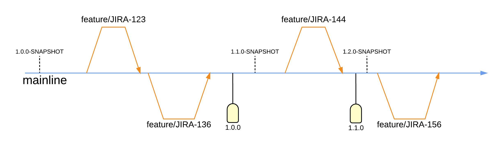
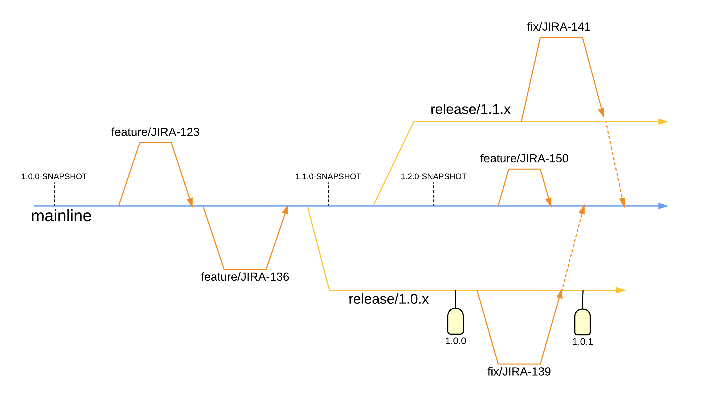

import NewsletterSignup from '~/components/common/newsletterSignup';

## Introduction

For a long time, I struggled finding the perfect Git strategy for my projects.

Many times I just felt overwhelmed by how complicated some of these strategies felt. "There must be a better way" I thought.

Then I stumbled into the "Release Branching Strategy" on [releaseflow](http://releaseflow.org/) and it was like a breath of fresh air.

I will explain a simplified overview of this approach that just works for me, for a more detailed one feel free to check out their website.

<NewsletterSignup client:visible />

## 1. Quick Overview

Here are the main steps of this strategy if you want to add a new feature:

1. You open a new `feature/` branch from the `main` branch and commit changes on it
2. You merge that branch directly into the `main` branch
3. You create a version tag on the `main` branch i.e.: `1.0.0`
4. You can then trigger any automated actions (GitHub actions, Jenkins, CI/CD...) when this tag is pushed. For instance I [have an automated deployment using GitHub actions to build and push my docker images to the registry](/blog/automatically-build-docker-images-with-github-actions/).

That's it!

> The version tags follow the [semver](https://semver.org/) convention.
> `major.minor.patch`
>
> - `major` when you create breaking changes
> - `minor` when you create backward compatible changes
> - `patch` when you need to fix a bug

This would be the sweet spot of this strategy:

But of course life is never this easy, and wheneve a feature is deployed it often comes with its bugs that we need to fix.

What then?

## 2. Patching branches

So what happens when you need to patch a released version? And how do your roll those changes back into the `main` branch?

Here are the steps:

1. Go back to the commit where you created the version tag and create a `release/1.0.x` branch from there. We want to leave the `x` to indicate that all patches will come from this branch.
2. Develop any bug fixes or patches directly on this branch or feel free to open new `bugfix/` branches from it. Ideally `bugfix/` branches should only be created on `release/` branches.
3. Once you're done with your fixes, create a new version tag on the `release/` branch, i.e.: `1.0.1`
4. Then you can get those changes back into `main` 2 ways:
   1. If it's a simple thing you can just cherry pick the changes into `main`
   2. If it's something more complicated you can merge those changes into `main` and handle any merge conflicts you might have

It's all much clearer with a diagram:

## Conclusions

I've been using this Git flow since I found it and it's been great.

Paired with a [GitHub action to build and push my docker images to a registry](/blog/automatically-build-docker-images-with-github-actions/) it's worked wonders.

You can get crazy and create staging/production tags to deploy to different servers and test, or create snapshot tags to keep track of when new changes were started to be made.

All while still keeping everything super simple.
