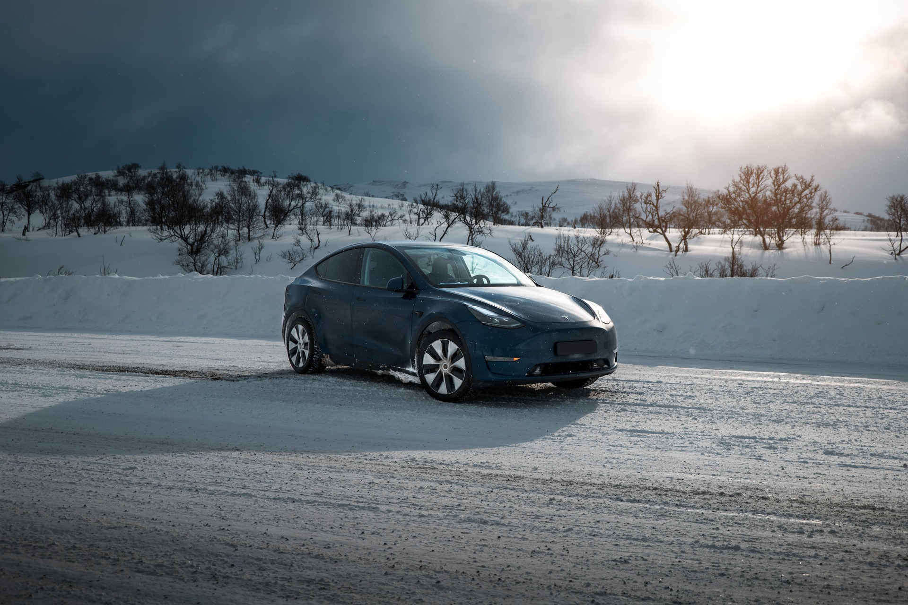
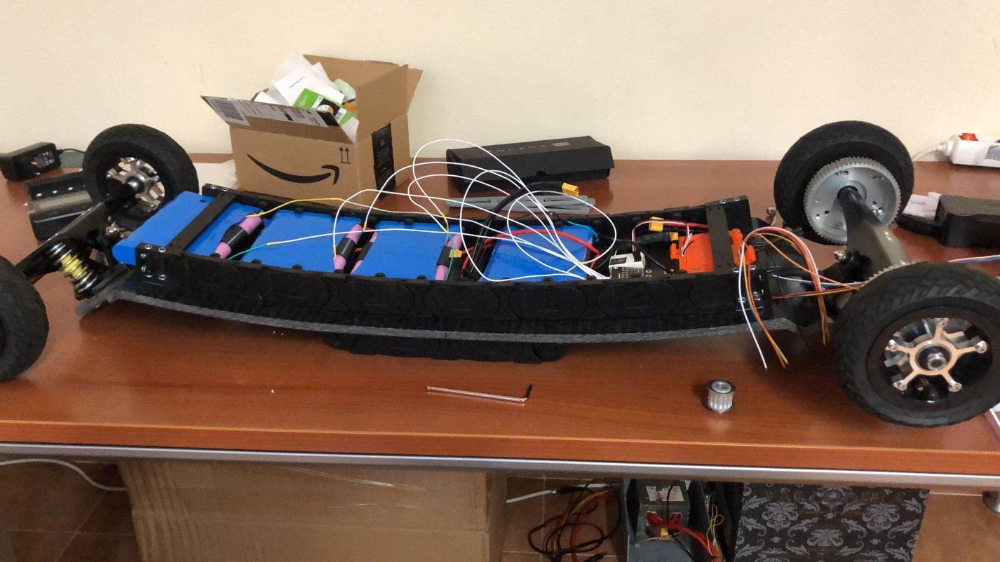

Hey! I'm Daniel, nice to meet you!

---

## Who am I?

I'm an Electro-Mechanical engineer based in Madrid, Spain with a passion for electronics, coding and all things computer engineering.

---

## My professional carreer

### **Correos** - 2020

While on my last year at uni I landed an internship at Correos, the national logistics company in Spain. I quickly became the "data guy" after someone asked me to manually update daily an excell with what felt a thousand columns (classic intern job!). I automated the whole process in Python, VBR and Power BI, and what previously took them a full day my computer did in 5 minutes.

It was here where I also picked up data analysis with R and SQL (and fell in love with it). After which I discovered the amazing world of Python and Pandas. Since they dindn't have a data engineer, I got suddenly flooded with a lot of responsibility of analysing field logistics data and providing a weekly update to the quality guys.

### **Tesla** - 2020 - 2023

After lockdown I really wanted to experience the world, this is where I landed a job at Tesla as a Field Support Engineering Intern in Oslo, Norway. Holy c\*\*p that was an adventure. This is the fastest environment I've ever worked in.

We worked closely with the design and service teams to improve the fleet, this is where my data skills came in handy, I started doing some cool research with the global field data, using Python and SQL (Spark and Caspian), to improve the products. I've never seen so much organized data, it was heaven to me! You wanted to see the average time users pressed the brakes during a drive in... lithuania, well go ahead! Data is king at Tesla, everything is to be justified with it.

When I wasn't analysing stuff in my laptop I was out in the field testing and collecting data myself. We did some nice cold weather tests in the arctic circle with the then-brand new Model Y to fix everything before it entered the market.

I also took advantage of my photography and video skills!

In early 2021 I got moved to France to do the same, but this time to help a colleage cover the Southern region of Europe which was begining to experience the Tesla Boom (as I like to call it). We also began testing new products in the South with hot climates.

Finally I arrived at my full time possition in my home city of Madrid. Here our team shifted and we became Field Quality Engineers under the newly opened Gigafactory Berlin (nice!). Here we got closer to factory processes and design teams, having a bigger (and much faster) impact on the stuff we were trying to improve.

By now I picked up a lot of backend processing with flask and front end developement with Javascript and HTML This landed me the oportunity to build a really useful app inside the company in a production environment.

Continuing with extreme tests we continued to actively test and collect telemetry of new products in the Arctic and Dubai.

**Entrepreneurship** - 2023 - Present

After my time at Tesla, I decided to go my own way. I am currently working on several projects, from the creation of a software and data consulting company to the development of web and mobile applications, as well as software services (SaaS).

You can check a list of my projects at [projects](/projects/).

---

## My love for engineering and coding

Since I was a little kid I've always been dismantling and modifying electronics (sorry Mom), I guess this engineering thing comes from far. To be honest, now I regret tearing appart my Gameboy Color to try and make a video-phone before Facetime was a thing.

I love gatgets and building stuff. I will always have a project undergoing at home.

The coding thing also starts from back in my school days, where I was the computer guy (before computer guys were cool), teachers would call me from another class to come fix the computer. There was a period where I really got into hacking stuff and that tought me a lot about networking, things have evolved a lot since then.

I started coding in C in my first year of uni for a course, here I got a taste of what you can do with code. Spoiler alert: Everything.

I later started getting into python as it let me do more stuff. I started building apps, automating stuff, combining it with physical hardware to make robots, etc.

Then I got into more complicated stuff like backend and front end development in Flask, Pandas, SQL, Javascript and HTML.

I have a big cool project going on called [Wayfinder](https://github.com/dontic/wayfinder) with which I learned a lot of stuff about Full Stack developement. This came from the idea that I wanted to see where I was a day 10 years ago, maybe a bit because of my data collecting and displaying obsession.

I also started building my own homelab to host my services and store all my data. It's a really fun experience using hypervisors, learning networking and coding your own services!

---

## Studies

I started my studies in Nebrija University in Madrid. Studied Electromechanical engineering and, most importantly, learned problem solving skills. Had some amazing proffesors here.

In 2016 I moved to Drexel University, Philadelphia for a year to do my junior year there. This was incredible, I got to join the Formula EV team there and help develop the powertrain for their car. From BMS to drive controller, all bolted down to a wooden plate (safe!), but hey, we got it working!

Always liked electric vehicles but the Formula EV team at Drexel really got me into it. After that I did an undergraduate thesis on a combinative powertrain based on different energy sources for electric cars (hydrogen, supercapacitors...).

Right into my masters degree in Engineering as well as an MBA, I continued with my projects, automating a garden with an arduino, monitored with Plotly and a webcam or programming some bots with Selenium.

This culminated in my Master Thesis on Electric Micromobility. Where I developed a super cool, maybe a bit dangerous, electric mountainboard. The dangerous part comes mainly from welding the batteries myself and the thing doing 60+ km/h.

---

## Want to reach out?

Throw me a message on [Linkedin](https://www.linkedin.com/in/gsdaniel/)!
