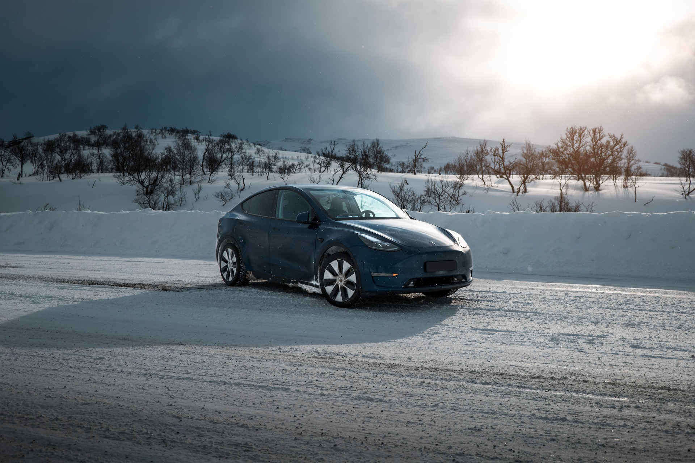
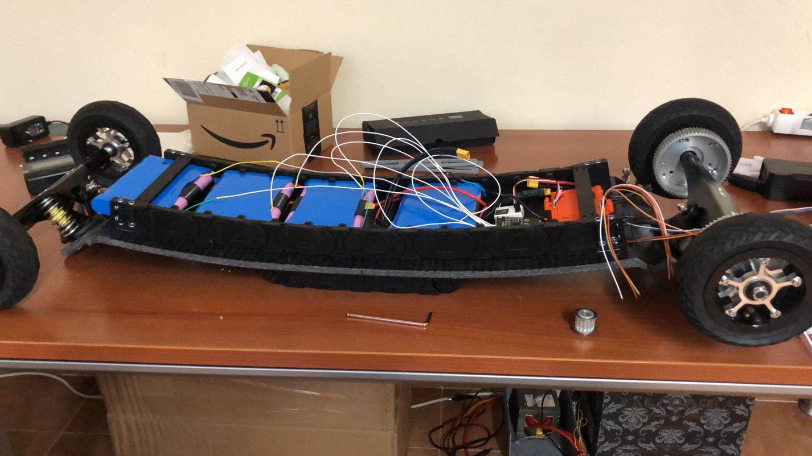

¡Hola! Soy Daniel, ¡encantado de conocerte!

---

## ¿Quién soy?

Soy un ingeniero electromecánico afincado en Madrid, España, apasionado de la electrónica, la programación y todo lo relacionado con la tecnología.

---

## Mi carrera profesional

### **Correos** - 2020

Durante mi último año en la universidad conseguí unas prácticas en Correos, la empresa nacional de logística en España. Rápidamente me convertí en el «chico de los datos» después de que alguien me pidiera que actualizara manualmente a diario un excell con lo que parecían miles de columnas (¡el clásico trabajo de becario!). Automaticé todo el proceso en Python, VBR y Power BI, y lo que antes les llevaba un día entero mi ordenador lo hacía en 5 minutos.

Fue aquí donde también me inicié en el análisis de datos con R y SQL (y me enamoré de ello). Después descubrí el increíble mundo de Python y Pandas. Como no tenían un ingeniero de datos, de repente me inundó una gran responsabilidad de analizar los datos de logística de campo y proporcionar una actualización semanal a los chicos de calidad.

### **Tesla** - 2020 - 2023

Después del encierro realmente quería experimentar el mundo, aquí es donde aterricé un trabajo en Tesla como pasante de ingeniería de soporte de campo en Oslo, Noruega. Santo c\*\*p que era una aventura. Es el entorno más rápido en el que he trabajado nunca.

Trabajamos en estrecha colaboración con los equipos de diseño y servicio para mejorar la flota, aquí es donde mis habilidades de datos fueron muy útiles, empecé a hacer algunas investigaciones interesantes con los datos de campo globales, utilizando Python y SQL (Spark y Caspian), para mejorar los productos. Nunca había visto tantos datos organizados, ¡era el paraíso para mí! Querías ver el tiempo medio que los usuarios pisaban el freno durante una conducción en... lituania, ¡pues adelante! Los datos son los reyes en Tesla, todo se justifica con ellos.

Cuando no estaba analizando cosas en mi portátil, estaba fuera, probando y recopilando datos. Hicimos unas bonitas pruebas de frío en el círculo polar ártico con el entonces flamante Model Y para arreglarlo todo antes de que saliera al mercado.

También aproveché mis conocimientos de fotografía y vídeo.

A principios de 2021 me trasladaron a Francia para hacer lo mismo, pero esta vez para ayudar a un colega a cubrir la región sur de Europa, que estaba empezando a experimentar el Boom Tesla (como me gusta llamarlo). También empezamos a probar nuevos productos en el sur, con climas cálidos.

Finalmente llegué a mi puesto a tiempo completo en Madrid, mi ciudad natal. Aquí nuestro equipo cambió y nos convertimos en Ingenieros de Calidad de Campo en la recién inaugurada Gigafactory de Berlín (¡qué bien!). Aquí nos acercamos más a los procesos de la fábrica y a los equipos de diseño, teniendo un impacto mayor (y mucho más rápido) en las cosas que intentábamos mejorar.

Por ahora he aprendido mucho de procesamiento backend con flask y front-end con Javascript y HTML Esto me dio la oportunidad de construir una aplicación muy útil dentro de la empresa en un entorno de producción.

Siguiendo con las pruebas extremas continuamos probando activamente y recogiendo telemetría de nuevos productos en el Ártico y Dubai.

### **Emprendimiento** - 2023 - Presente

Después de mi paso por Tesla, decidí emprender mi propio camino. Actualmente estoy trabajando en varios proyectos, desde la creación de una empresa de consultoría de software y datos hasta el desarrollo de aplicaciones web y móviles, así como servicios de software (SaaS).

Puedes consultar una lista de mis proyectos en [proyectos](/es/projects/).

---

## Mi amor por la ingeniería y el software

Desde pequeño siempre he estado desmontando y modificando aparatos electrónicos (lo siento mamá), supongo que esto de la ingeniería viene de lejos. Para ser sincero, ahora me arrepiento de haber destrozado mi Gameboy Color para intentar hacer un videoteléfono antes de que existiera Facetime.

Me encantan los gatgets y construir cosas. Siempre tendré un proyecto en marcha en casa.

Lo de programar también viene de mi época escolar, cuando yo era el informático (antes de que los informáticos fueran guays) y los profesores me llamaban de otra clase para que fuera a arreglar el ordenador. Hubo un periodo en el que me metí de lleno en el mundo de la piratería informática y aprendí mucho sobre redes; las cosas han evolucionado mucho desde entonces.

Empecé a programar en C en mi primer año de universidad para un curso, aquí tuve una idea de lo que se puede hacer con el código. Alerta de spoiler: todo.

Más tarde empecé a meterme en python porque me permitía hacer más cosas. Empecé a construir aplicaciones, automatizar cosas, combinarlo con hardware físico para hacer robots, etc.

Luego me metí en cosas más complicadas como el desarrollo backend y frontend en Flask, Pandas, SQL, Javascript y HTML.

Tengo un gran proyecto en marcha llamado [Wayfinder](https://github.com/dontic/wayfinder) con el que aprendí un montón de cosas sobre desarrollo Full Stack. Esto vino de la idea de que quería ver dónde estaba un día hace 10 años, tal vez un poco por mi obsesión de recopilación y visualización de datos.

También empecé a construir mi propio homelab para alojar mis servicios y almacenar todos mis datos. Es una experiencia muy divertida utilizar hipervisores, aprender a trabajar en red y programar tus propios servicios.

---

## Estudios

Empecé mis estudios en la Universidad Nebrija de Madrid. Estudié ingeniería electromecánica y, lo más importante, aprendí a resolver problemas. Tuve unos profesores increíbles aquí.

En 2016 me mudé a la Universidad de Drexel, Filadelfia por un año para hacer mi tercer año allí. Fue increíble, pude unirme al equipo de Fórmula EV y ayudar a desarrollar el tren motriz de su coche. Desde el BMS hasta el controlador de accionamiento, todo atornillado a una placa de madera (¡seguro!), pero bueno, ¡lo conseguimos!

Siempre me han gustado los vehículos eléctricos, pero el equipo de Fórmula EV de Drexel fue lo que más me atrajo. Después hice una tesis de licenciatura sobre una cadena cinemática combinada basada en diferentes fuentes de energía para coches eléctricos (hidrógeno, supercondensadores...).

Ya en mi máster en Ingeniería, así como en un MBA, continué con mis proyectos, automatizando un jardín con un arduino, monitorizado con Plotly y una webcam o programando algunos bots con Selenium.

Esto culminó en mi Tesis de Máster sobre Micromovilidad Eléctrica. Donde desarrollé una mountainboard eléctrica super chula y quizás un poco peligrosa. La parte peligrosa viene principalmente de soldar las baterías yo mismo y la cosa haciendo 60+ km/h.

---

## ¿Quieres contactar conmigo?

¡Lánzame un mensaje en [Linkedin](https://www.linkedin.com/in/gsdaniel/)!
